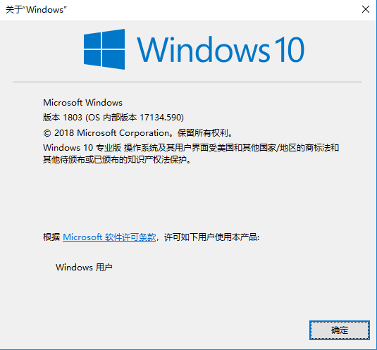
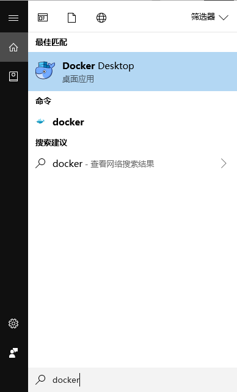
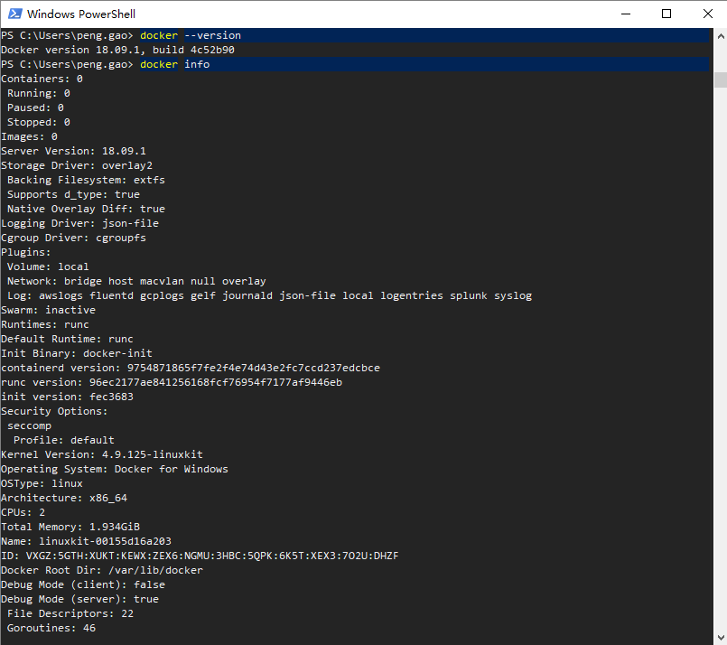

# 1.1 Docker 安装

前往 [Docker 官方文档](https://docs.docker.com/install/)，选择适合的平台安装即可。

比如这里我将在 CentOS 与 Windows 平台上安装 Docker。

## CentOS

这里使用的系统版本为 CentOS 7.6。

```bash
$ uname -r
3.10.0-957.el7.x86_64

$ cat /etc/centos-release
CentOS Linux release 7.6.1810 (Core)
```

有三种安装方式：

- 配置 Docker Yum 源安装

- 手动下载 RPM 软件包安装

- 使用 Docker 官方脚本安装

这里使用 Docker Yum 源进行安装。

1. 安装依赖包

   ```bash
   $ yum install -y yum-utils device-mapper-persistent-data lvm2
   ```

2. 配置 Docker Yum 源

   ```bash
   $ yum-config-manager --add-repo https://download.docker.com/linux/centos/docker-ce.repo
   ```

3. 安装 Docker CE

   * 安装最新版本的 Docker CE：

     ```bash
     $ yum install -y docker-ce docker-ce-cli containerd.io

     $ docker --version
     Docker version 18.09.2, build 6247962
     ```

   * 安装指定版本的 Docker CE：

     ```bash
     $ yum list docker-ce --showduplicates | sort -r
     docker-ce.x86_64     3:18.09.2-3.el7                           docker-ce-test   
     docker-ce.x86_64     3:18.09.2-3.el7                           docker-ce-stable 
     docker-ce.x86_64     3:18.09.2-3.el7                           @docker-ce-stable
     docker-ce.x86_64     3:18.09.1-3.el7                           docker-ce-test   
     docker-ce.x86_64     3:18.09.1-3.el7                           docker-ce-stable 
     docker-ce.x86_64     3:18.09.1-2.1.rc1.el7                     docker-ce-test   
     docker-ce.x86_64     3:18.09.1-1.2.beta2.el7                   docker-ce-test   
     docker-ce.x86_64     3:18.09.1-1.1.beta1.el7                   docker-ce-test   
     docker-ce.x86_64     3:18.09.0-3.el7                           docker-ce-test   
     docker-ce.x86_64     3:18.09.0-3.el7                           docker-ce-stable
     ...

     $ yum install -y docker-ce-18.09.1 docker-ce-cli-18.09.1 containerd.io
     ```

4. 启动 Docker

   ```bash
   $ systemctl enable --now docker.service

   $ docker info
   Containers: 0
    Running: 0
    Paused: 0
    Stopped: 0
   Images: 0
   Server Version: 18.09.2
   Storage Driver: overlay2
    Backing Filesystem: xfs
   ...
   ```

## Windows

开发人员想在自己的电脑上使用 Docker 方便开发测试使用，可以直接在 Windows 系统上安装 Docker。

安装 Docker 的 Windows 系统要求：

- Windows 10 64 位：Pro、Enterprise 或 Education（1607 版本，Build 14393 或更高版本）；

- 在 BIOS 中启用虚拟化；

- 具有 CPU SLAT 功能；

- 至少 4 GB 内存。

这里使用的是 Windows Pro 1803 版本。



安装 Docker：

1. 下载适用于 Windows 的 [Docker Desktop](https://hub.docker.com/editions/community/docker-ce-desktop-windows)。

2. 双击 Docker for Windows Installer.exe 运行安装程序。

3. 安装完成后启动 Docker Desktop。

   

4. 运行 Powershell 检测是否安装完成。
   
   


## 参考

- [Get Docker CE for CentOS](https://docs.docker.com/install/linux/docker-ce/centos/)

- [Install Docker Desktop for Windows](https://docs.docker.com/docker-for-windows/install/)