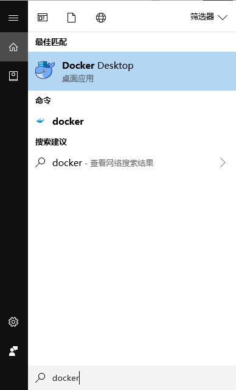

# 1.1 Docker 简介与安装

## 简介

**Docker 容器其实就是一种特殊的进程**。

其实 Docker 容器只是使用了 Linux 内核的一些技术：

- [Namespace](https://coolshell.cn/articles/17010.html) 技术对进程进行隔离；

- [Cgroups](https://coolshell.cn/articles/17049.html) 技术对进程进行资源限制；

- [Union FS](https://coolshell.cn/articles/17061.html)（目前 Docker 主要使用 Overlay2，不过 Overlay 与 AUFS 差别不是很大，可以先了解一下 AUFS）技术为进程构建出一个完善的文件系统。

这样这个进程看起来就像是独立的操作系统了，这也是为什么很多人会把 Docker 项目称为「轻量级」虚拟化技术的原因，实际上是把虚拟机的概念套在了容器上。

不过我一直很排斥将 Docker 视为轻量级虚拟机技术的说法。如果把容器当做虚拟机使用的话，要进入容器进行调试该怎么办？ SSH 要怎么配置？ 一个容器里面是否应该启动多个进程？是否需要备份容器？这些问题都不好处理。如果把容器当做虚拟机使用，不建议使用 Docker 技术，而是直接去使用虚拟机来运行你的服务。

所以我们要正确使用 Docker，就要建立起**容器化思维**。要意识到容器的本质其实就是一个进程。当理解了容器实际上是一个进程以后：

- 我们就不需要去备份容器了，而是应该把需要备份的数据放在容器外进行备份；

- 我们也不应该去在容器里启动多个进程了（可以，但没必要，除非特殊需要），因为容器本身就是一个单进程模式；

- 我们更不应该使用 SSH 的方式来进入容器了，只需要进入容器的文件系统内即可。

所以 Docker 容器和虚拟机完全不同，在运行 Docker 时，并没有一个真正的「Docker 容器」运行在宿主机上面。 Docker 帮你启动的，还是原来的应用进程，只不过创建这些进程时，Docker 为它们加上了各种各样的隔离与限制，这样使用 Docker 运行的进程就仿佛运行在一个一个「容器」里面，与世隔绝。 其实只不过都是「障眼法」罢了。

下面是官方给出的 Docker 与传统虚拟机的对比图：


这幅图的左边为虚拟机的工作原理。其中 Hypervisor 的软件是虚拟机最主要的部分。它通过硬件[虚拟化](https://www.redhat.com/zh/topics/virtualization/what-is-virtualization)功能，模拟出了运行一个操作系统所需要的各种硬件，比如 CPU、内存、I/O 设备等等。然后，它在这些虚拟的硬件上安装了一个新的操作系统，即 Guest OS。

而这幅图的右边，则用了一个 Docker Engine 的软件替换了 Hypervisor，属于[操作系统层面的虚拟化技术](https://en.wikipedia.org/wiki/Container_virtualization)),因为上层只是与系统其它部分隔离开的一系列进程，所以叫做[容器](https://www.redhat.com/zh/topics/containers/whats-a-linux-container)。

## Docker 的优势

- **更高效的利用系统资源**。<br/>由于容器不需要进行硬件虚拟以及运行完整操作系统等额外开销，Docker 对系统资源的利用率更高。

- **更快速的启动时间**。<br/>启动一个虚拟机需要数分钟，而 Docker 容器应用由于直接运行于宿主内核，无需启动完整的操作系统，因此可以做到秒级启动。

- **一致的运行环境**。<br/>开发过程中一个常见的问题就是环境一致性的问题。由于开发环境、测试环境、生产环境不一致，导致有些 Bug 并未在开发过程中发现。而 Docker 的镜像提供了除内核外完整的运行时环境（上面提到的 Union FS 文件系统），确保了应用运行环境一致行。

- **更轻松的迁移**。<br/>由于 Docker 确保了执行环境的一致性，使得应用的迁移更加容易。Docker 可以在很多平台上运行：物理机、虚拟机、公有云、私有云、甚至是个人电脑（Windows 系统或 MAC OS），其运行结果是一致的。因此用户可以很轻易的将一个平台上运行的容器迁移到另一个平台上。

- **持续交付和部署**。<br/>对开发和运维（DevOps）人员来说，最希望的就是一次创建和配置，可以在任意地方政策运行。使用 Docker 可以通过定制应用镜像来实现持续集成、持续交付、部署。开发人员可以通过 Dockerfile 来进行镜像构建，并结合持续集成（CI）系统进行集成测试，而运维人员则可以直接在生产环境中快速部署该镜像，还能结合持续部署（CD）系统进行自动部署。而且开发人员使用 Dockerfile 使镜像构建透明化，不仅仅开发团队可以理解应用运行环境，也方便运维团队理解应用运行所需条件。

## Docker 安装

前往 [Docker 官方文档](https://docs.docker.com/install/)，选择适合的平台安装即可。

比如这里我将在 CentOS 与 Windows 平台上安装 Docker。

### CentOS

这里使用的系统版本为 CentOS 7.6。

```bash
$ uname -r
3.10.0-957.el7.x86_64

$ cat /etc/centos-release
CentOS Linux release 7.6.1810 (Core)
```

有三种安装方式：

- 配置 Docker Yum 源安装

- 手动下载 RPM 软件包安装

- 使用 Docker 官方脚本安装

这里使用 Docker Yum 源进行安装。

1. 安装依赖包

   ```bash
   $ yum install -y yum-utils device-mapper-persistent-data lvm2
   ```

2. 配置 Docker Yum 源

   ```bash
   $ yum-config-manager --add-repo https://download.docker.com/linux/centos/docker-ce.repo
   ```

3. 安装 Docker CE

   * 安装最新版本的 Docker CE：

     ```bash
     $ yum install -y docker-ce docker-ce-cli containerd.io

     $ docker --version
     Docker version 18.09.2, build 6247962
     ```

   * 安装指定版本的 Docker CE：

     ```bash
     $ yum list docker-ce --showduplicates | sort -r
     docker-ce.x86_64     3:18.09.2-3.el7                           docker-ce-test   
     docker-ce.x86_64     3:18.09.2-3.el7                           docker-ce-stable 
     docker-ce.x86_64     3:18.09.2-3.el7                           @docker-ce-stable
     docker-ce.x86_64     3:18.09.1-3.el7                           docker-ce-test   
     docker-ce.x86_64     3:18.09.1-3.el7                           docker-ce-stable 
     docker-ce.x86_64     3:18.09.1-2.1.rc1.el7                     docker-ce-test   
     docker-ce.x86_64     3:18.09.1-1.2.beta2.el7                   docker-ce-test   
     docker-ce.x86_64     3:18.09.1-1.1.beta1.el7                   docker-ce-test   
     docker-ce.x86_64     3:18.09.0-3.el7                           docker-ce-test   
     docker-ce.x86_64     3:18.09.0-3.el7                           docker-ce-stable
     ...

     $ yum install -y docker-ce-18.09.1 docker-ce-cli-18.09.1 containerd.io
     ```

4. 启动 Docker

   ```bash
   $ systemctl enable --now docker.service

   $ docker info
   Containers: 0
    Running: 0
    Paused: 0
    Stopped: 0
   Images: 0
   Server Version: 18.09.2
   Storage Driver: overlay2
    Backing Filesystem: xfs
   ...
   ```

### Windows

开发人员想在自己的电脑上使用 Docker 方便开发测试使用，可以直接在 Windows 系统上安装 Docker。

安装 Docker 的 Windows 系统要求：

- Windows 10 64 位：Pro、Enterprise 或 Education（1607 版本，Build 14393 或更高版本）；

- 在 BIOS 中启用虚拟化；

- 具有 CPU SLAT 功能；

- 至少 4 GB 内存。

这里使用的是 Windows Pro 1803 版本。


安装 Docker：

1. 下载适用于 Windows 的 [Docker Desktop](https://hub.docker.com/editions/community/docker-ce-desktop-windows)。

2. 双击 Docker for Windows Installer.exe 运行安装程序。

3. 安装完成后启动 Docker Desktop。

   

4. 运行 Powershell 检测是否安装完成。
   
   

## 总结

1. 首先记住，容器的本质只是一个进程。要用看待进程的方式来看待一个容器，而不是用看待虚拟机的方式来看待容器。

2. 是否要用 Docker 也要考虑你的应用代码是否面对经常的变更与解耦，可以参考现在流行的微服务。对于半年、一年或许才更新一次的应用来说，用虚拟机或者物理机部署会更加合适。

3. Docker 项目其实并没有很复杂的技术实现，依赖的还是 Linux 底层技术，比如 Linux Namaspace 技术、Linux Cgroups 技术、以及类 Rootfs 技术实现的联合文件系统（Union FS）。有兴趣可以查阅这些 Linux 底层技术的资料。

4. 其实容器本身是没有价值的，有价值的是「容器编排与调度」，比如说 Docker Swarm 、Kubernetes、Mesos 等。容器技术生态爆发的关于「容器编排」的战争，最终以 Kubernetes 项目和 CNCF 社区的胜利而告终。为什么 Docker 公司在这场战争中占据了很有利的先天条件（Docker 项目）还败给了 Google 公司推出的 Kubernetes，以后我会介绍这两种编排调度系统。有兴趣的话也可以在网上查阅一下有关于[容器编排战争](https://zhuanlan.zhihu.com/p/35951990)的资料。

## 参考

- [什么是 Linux 容器？](https://www.redhat.com/zh/topics/containers/whats-a-linux-container)

- [何为虚拟化？](https://www.redhat.com/zh/topics/virtualization/what-is-virtualization)

- [Get Docker CE for CentOS](https://docs.docker.com/install/linux/docker-ce/centos/)

- [Install Docker Desktop for Windows](https://docs.docker.com/docker-for-windows/install/)