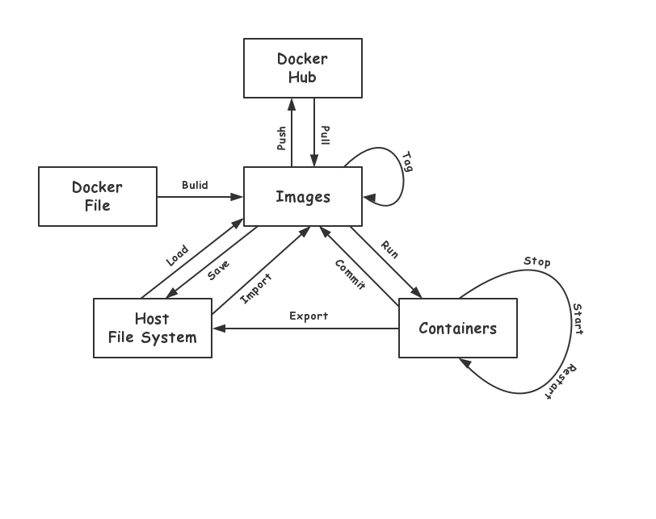
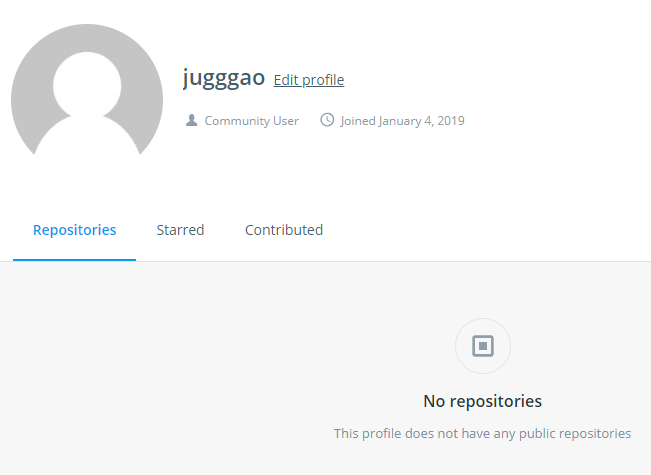
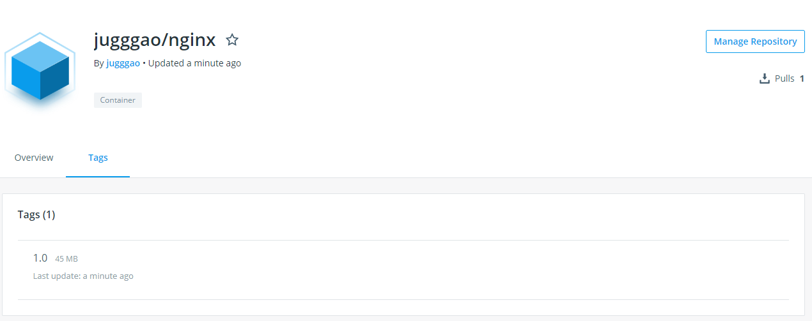

# 1.2 Docker 容器和镜像的基本操作

首先，用一张图来概括 Docker 容器和镜像的一些常用命令。



我们根据这幅图来介绍一下 Docker 的一些基本概念：

- 镜像（Images）：Docker 镜像是一个特殊的文件系统，除了提供容器运行时所需的程序、库、资源、配置等文件外，还包含了一些为运行时准备的一些配置参数（如环境变量、用户等）。

- 容器（Container）：镜像和容器的关系，就像是面对对象程序设计中的类和实例一样，镜像是静态的定义，容器是镜像运行时的实体。

- 仓库（Docker Registry）：集中存储、分发镜像的服务。比如说 Docker Hub。

接下来我们来根据这个图来说明一些 Docker 镜像和容器的一些基本操作方法。

## 获取镜像

Docker 官方提供了一个公共的镜像仓库：[Docker Hub](https://hub.docker.com/search/?type=image)，我们可以从这上面获取镜像。

获取镜像的命令为：

```bash
Usage:  docker image pull [OPTIONS] [Docker Registry[:Port]/]Name[:TAG]
```

- Docker 镜像仓库地址：地址的格式一般是<域名/IP>[:端口]，如果不填写默认为 Docker Hub。

- 仓库名：仓库名是两段式名称，即<用户名>/<软件名>。对于 Docker Hub，如果不填写用户名，则默认为 Library，也就是官方镜像。

- 标签：对于同一个仓库名，可能会存在多个标签，即多个版本。如果不填写标签，默认为 latest 标签。

比如，我们下载一个 CentOS 官方镜像：

```bash
$ docker image pull centos
Using default tag: latest
latest: Pulling from library/centos
a02a4930cb5d: Pull complete 
Digest: sha256:184e5f35598e333bfa7de10d8fb1cebb5ee4df5bc0f970bf2b1e7c7345136426
Status: Downloaded newer image for centos:latest
```

上面的命令没有给出 Docker 镜像仓库地址，因此将会从 Docker Hub 获取镜像；也没有给出用户名，因此会从官方镜像库即 Library 获取 CentOS 镜像；也没有给出标签，因此会获取 latest 标签的 CentOS 镜像。

通常我们会指定标签获取指定版本的镜像：

```bash
$ docker image pull ubuntu:16.04
16.04: Pulling from library/ubuntu
7b722c1070cd: Pull complete 
5fbf74db61f1: Pull complete 
ed41cb72e5c9: Pull complete 
7ea47a67709e: Pull complete 
Digest: sha256:e4a134999bea4abb4a27bc437e6118fdddfb172e1b9d683129b74d254af51675
Status: Downloaded newer image for ubuntu:16.04
```

## 列出镜像

获取完镜像，我们可以列出我们已经获取到的本地镜像。

列出镜像的命名为：

```bash
Usage:  docker image ls [OPTIONS] [REPOSITORY[:TAG]]
```

例如，我们列出所有的镜像：

```bash
$ docker image ls
REPOSITORY          TAG                 IMAGE ID            CREATED             SIZE
ubuntu              16.04               7e87e2b3bf7a        3 weeks ago         117MB
centos              7                   1e1148e4cc2c        2 months ago        202MB
centos              latest              1e1148e4cc2c        2 months ago        202MB
```

## 删除镜像

如果本地镜像仓库中的镜像有不需要用到的，我们可以删除镜像来释放出硬盘资源。

删除镜像的命令如下：

```bash
Usage:  docker image rm [OPTIONS] IMAGE [IMAGE...]
```
比如，我们删除刚才下载的 centos:7 镜像：

```bash
$ docker image rm centos:7
Untagged: centos:7
Untagged: centos@sha256:184e5f35598e333bfa7de10d8fb1cebb5ee4df5bc0f970bf2b1e7c7345136426
Deleted: sha256:1e1148e4cc2c148c6890a18e3b2d2dde41a6745ceb4e5fe94a923d811bf82ddb
Deleted: sha256:071d8bd765171080d01682844524be57ac9883e53079b6ac66707e192ea25956
```

## 运行容器

有了 Docker 镜像后，我们就可以以这个镜像为基础启动并运行一个容器。

运行容器的命令为：

```bash
Usage:  docker container run [OPTIONS] IMAGE [COMMAND] [ARG...]
```

以上面的 Ubuntu 16.04 镜像为例，我们来启动里面的 bash 并且进行交互式操作，可以执行以下命令。

```bash
$ docker container run -it --rm ubuntu:16.04 /bin/bash
root@f07761908385:/# cat /etc/os-release 
NAME="Ubuntu"
VERSION="16.04.5 LTS (Xenial Xerus)"
ID=ubuntu
ID_LIKE=debian
PRETTY_NAME="Ubuntu 16.04.5 LTS"
VERSION_ID="16.04"
HOME_URL="http://www.ubuntu.com/"
SUPPORT_URL="http://help.ubuntu.com/"
BUG_REPORT_URL="http://bugs.launchpad.net/ubuntu/"
VERSION_CODENAME=xenial
UBUNTU_CODENAME=xenial
root@afcf72ed65a5:/# exit
exit
```

Run 命令的用法在以后会详细总结，先简要说明下上面用到的参数。

- -it：这是两个参数，一个是 -i，表示以交互模式运行容器；一个是 -t，表示为容器分配一个伪终端。通常这两个参数结合使用。我们需要进入 bash 执行一些命令并查看返回结果，因此我们需要交互式终端。

- --rm：这个参数表示退出容器时会将容器删除。默认情况下，为了排障需求，退出容器不会删除容器，除非手动执行 docker rm 命令。我们这里只是进行简单的验证与查看结果，不需要排障和保留结果，因此使用 --rm 参数可以避免浪费空间。

- ubuntu:16.04：这里指定镜像名称为 ubuntu:16.04。

- /bin/bash：放在镜像名后面的命令，我们的目的是有个交互式的 Shell 来执行命令，因此用的是 bash。

进入容器后，我们可以在 Shell 环境下操作，执行命令。这里我们执行了 `cat /etc/os-release`，从返回的结果看到容器内是 Ubuntu 16.04.5 LTS 系统。 最后我们通过 `exit` 退出了容器。

## 后台运行容器

通常情况下，我们需要让 Docker 在后台运行而不是直接把执行命令的结果输出在当前宿主机下。此时，可以通过添加 `-d` 参数来实现。

下面，我们举两个例子来说明一下：

首先，不使用 `-d` 参数来运行 nginx 容器：

```
$ docker container run -p 80:80 --name nginx nginx:1.14.2

```

- -p：这里 -p 参数表示将容器内的端口映射至宿主机上。

- --name: 指定容器的容器名称，如果不指定会随机分配一个。

此时我们在浏览器中输入宿主机的 ip:port，比如我这里是 http://10.10.113.16/ ，容器就会把输出的结果（STOUT）打印到宿主机上面：

```
$ docker container run -p 80:80 --name nginx nginx:1.14.2
10.10.22.162 - - [14/Feb/2019:02:27:54 +0000] "GET /favicon.ico HTTP/1.1" 404 571 "http://10.10.113.16/" "Mozilla/5.0 (Windows NT 10.0; Win64; x64) AppleWebKit/537.36 (KHTML, like Gecko) Chrome/72.0.3626.96 Safari/537.36" "-"
```

并且我们使用 <Ctrl-C> 快捷键退出当前的输出流后，这个容器也会随之停止。

然后，我们使用 `-d` 参数来运行 nginx 容器：

```
docker container run -d -p 80:80 --name nginx nginx:1.14.2
660e2ee880a74785582dbc4baac96c3a99a6e8300e02dcdc689c1e5d9fe0fe38
```

使用 `-d` 参数启动后会返回一个唯一的容器 id。此时容器就在后台运行，我们依然可以通过浏览器访问 http://10.10.113.16/ 。

## 列出容器

我们在后台运行容器后，可以列出正在运行的容器。

列出容器的命令如下：

```bash
Usage:  docker container ls [OPTIONS]
```

比如，我们列出刚才在后台运行的 Nginx 容器：

```
$ docker container ls
CONTAINER ID        IMAGE               COMMAND                  CREATED             STATUS              PORTS                NAMES
660e2ee880a7        nginx:1.14.2        "nginx -g 'daemon of…"   7 seconds ago       Up 6 seconds        0.0.0.0:80->80/tcp   nginx
```

默认情况下，只会列出正在运行的容器。如果想列出所有的容器，包括已经停止的容器则需要添加 `-a` 参数。

```
$ docker container ls -a
CONTAINER ID        IMAGE               COMMAND                  CREATED             STATUS                      PORTS                NAMES
660e2ee880a7        nginx:1.14.2        "nginx -g 'daemon of…"   58 seconds ago      Up 57 seconds               0.0.0.0:80->80/tcp   nginx
d9e0537848da        nginx:1.14.2        "nginx -g 'daemon of…"   21 minutes ago      Exited (0) 20 minutes ago                        tender_villani
```

## 终止、启动与重启容器

我们可以使用 `docker container stop` 命令来停止一个正在运行中的容器：

```bash
$ docker container stop nginx
nginx

# 此时可以看到 nginx 容器已经处于停止状态
docker container ls -a
CONTAINER ID        IMAGE               COMMAND                  CREATED             STATUS                      PORTS               NAMES
660e2ee880a7        nginx:1.14.2        "nginx -g 'daemon of…"   20 minutes ago      Exited (0) 11 minutes ago                       nginx
```

对于已停止的容器，我们可以使用 `docker container start` 命令来启动一个处于停止状态的容器：

```bash
$ docker container start nginx
nginx
```

我们还可以用 `docker container restart` 命令来重启容器：

```bash
$ docker container restart nginx
nginx
```

## 查看容器日志

对于后台运行的容器，我们可以通过 `docker container logs` 命令来查看正在运行容器的日志：

```bash
$ docker container logs nginx
10.10.22.162 - - [14/Feb/2019:03:06:39 +0000] "GET / HTTP/1.1" 304 0 "-" "Mozilla/5.0 (Windows NT 10.0; Win64; x64) AppleWebKit/537.36 (KHTML, like Gecko) Chrome/72.0.3626.96 Safari/537.36" "-"
```

并且我们可以通过添加 `-f` 参数实时跟踪容器的日志：

```bash
$ docker container logs -f nginx
10.10.22.162 - - [14/Feb/2019:03:06:39 +0000] "GET / HTTP/1.1" 304 0 "-" "Mozilla/5.0 (Windows NT 10.0; Win64; x64) AppleWebKit/537.36 (KHTML, like Gecko) Chrome/72.0.3626.96 Safari/537.36" "-"
10.10.22.162 - - [14/Feb/2019:03:06:40 +0000] "GET / HTTP/1.1" 304 0 "-" "Mozilla/5.0 (Windows NT 10.0; Win64; x64) AppleWebKit/537.36 (KHTML, like Gecko) Chrome/72.0.3626.96 Safari/537.36" "-"
```

这对于排查故障很有帮助。

## 进入容器

有多种进入容器的方式，这里我们只介绍 2 中方式：

1. 第一种，使用 `docker container attach` 进入容器。

   这种方式表示将本地标准输入、输出、错误附加到正在运行的容器中。

   ```bash
   $ docker container attach nginx

   ```

   这时，如果容器启动时执行的命令不是 bash 或者其他的 Shell 环境的话，是无法执行命令的，可以理解为把后台启动容器以前台的方式呈现。

   这种方式进入容器后，使用 <Ctrl-C> 快捷键退出输出流时，容器也会停止：

   ```bash
   $ docker container attach nginx
   ^C
   $ docker container ls -a
   CONTAINER ID        IMAGE               COMMAND                  CREATED             STATUS                      PORTS               NAMES
   660e2ee880a7        nginx:1.14.2        "nginx -g 'daemon of…"   35 minutes ago      Exited (0) 41 seconds ago                       nginx
   ```

   因此不推荐使用这种方式来进入容器。

2. 第二种，使用 `docker container exec` 在容器内执行命令来启动一个交互式的终端进入容器。

   这种方式，相当于在容器内运行一个 bash 环境令并且添加参数 `-it` 来启动一个交互式的终端。

   ```bash
   $ docker container exec -ti nginx /bin/bash
   root@1425410889aa:/#
   ```

   这样我们就可以在容器内执行命令了。比如我们修改主页的代码：

   ```bash
   $ docker container exec -ti nginx /bin/bash
   root@1425410889aa:/# cd /usr/share/nginx/html/
   root@1425410889aa:/usr/share/nginx/html# echo test > index.html
   root@1425410889aa:/usr/share/nginx/html# exit
   exit
   ```

   此时执行 `exit` 退出容器后容器也不会停止，我们访问 nginx 会发现主页已经被修改：

   ```bash
   $ curl http://10.10.113.16
   test
   ```

   这也是为什么推荐使用 `docker container exec` 的原因。


## 删除容器

我们可以使用 `docker container rm` 来删除一个已经处于停止状态下的容器：

```bash
$ docker container stop nginx
nginx

$ docker container rm nginx
nginx
```

也可以添加 `-f` 参数来删除一个正在运行中的容器：

```bash
$ docker container ls
CONTAINER ID        IMAGE               COMMAND                  CREATED             STATUS              PORTS                NAMES
b9f3e39cc713        nginx:1.14.2        "nginx -g 'daemon of…"   33 seconds ago      Up 33 seconds       0.0.0.0:80->80/tcp   nginx

$ docker container rm -f nginx
nginx
```

## 根据容器的更改定制镜像

镜像是容器的基础，每次执行 `docker container run` 时都会指定一个镜像作为容器运行的基础。

在之前的例子中，我们都是使用来自 Docker Hub 的官方镜像。直接使用这些镜像是可以满足一定的需求。但有时候无法直接满足需求时，我们就需要定制这些镜像。

我们依然运行一个 nginx 容器：

```bash
$ docker container run -d -p 80:80 --name nginx nginx:1.14.2
```

然后进入 nginx 容器修改主页：

```bash
$ docker container exec -ti nginx /bin/bash
root@b1d959eea100:/# echo '<h1>Hello, Docker!</h1>' > /usr/share/nginx/html/index.html
```

现在刷新浏览器的话，会发现主页的内容发生变化：

```bash
curl http://10.10.113.16
<h1>Hello, Docker!</h1>
```

我们修改了容器的文件，也就是改动了容器的存储层。我们可以通过 `docker container diff` 命令看到具体的改动：

```bash
$ docker container diff nginx
C /usr
C /usr/share
C /usr/share/nginx
C /usr/share/nginx/html
C /usr/share/nginx/html/index.html
C /root
A /root/.bash_history
C /var
C /var/cache
C /var/cache/nginx
A /var/cache/nginx/client_temp
A /var/cache/nginx/fastcgi_temp
A /var/cache/nginx/proxy_temp
A /var/cache/nginx/scgi_temp
A /var/cache/nginx/uwsgi_temp
C /run
A /run/nginx.pid
```

- A：文件或目录被添加

- D：文件或目录被删除

- C：文件或目录被修改

现在我们定制好了容器的更改内容，接下来希望能将这个容器保存下来变成镜像以后可以直接使用。

当我们运行一个容器的时候（如果不使用共享数据卷），我们做任何文件的修改都会被记录于容器存储层，而 Docker 提供了一个 `docker container commit` 命令可以将容器的存储层保存下来成为镜像。即在原有的镜像基础上，再叠加上容器的存储层，并构成新的镜像。

```bash
$ docker commit --author "Peng.Gao" --message "修改默认首页" nginx jugggao/nginx:1.0
sha256:62f1198899f38b566c0057b9448ae46666e73c013ad878c3de3ba56fed34ddf3
```

我们还可以使用 `docker image history` 来查看镜像内的历史记录：

```bash
$ docker image history jugggao/nginx:1.0
IMAGE               CREATED              CREATED BY                                      SIZE                COMMENT
62f1198899f3        About a minute ago   nginx -g daemon off;                            92B                 修改默认首页
1293e2b0a1af        7 days ago           /bin/sh -c #(nop)  CMD ["nginx" "-g" "daemon…   0B                  
<missing>           7 days ago           /bin/sh -c #(nop)  STOPSIGNAL SIGTERM           0B                  
<missing>           7 days ago           /bin/sh -c #(nop)  EXPOSE 80                    0B                  
<missing>           7 days ago           /bin/sh -c ln -sf /dev/stdout /var/log/nginx…   22B                 
<missing>           7 days ago           /bin/sh -c set -x  && apt-get update  && apt…   53.8MB              
<missing>           7 days ago           /bin/sh -c #(nop)  ENV NJS_VERSION=1.14.2.0.…   0B                  
<missing>           7 days ago           /bin/sh -c #(nop)  ENV NGINX_VERSION=1.14.2-…   0B                  
<missing>           7 days ago           /bin/sh -c #(nop)  LABEL maintainer=NGINX Do…   0B                  
<missing>           8 days ago           /bin/sh -c #(nop)  CMD ["bash"]                 0B                  
<missing>           8 days ago           /bin/sh -c #(nop) ADD file:5a6d066ba71fb0a47…   55.3MB
```

定制好新的镜像后，我们可以从这个镜像来运行容器：

```bash
$ docker container rm -f nginx
nginx

$ docker container run -d --name nginx -p 80:80 jugggao/nginx:1.0
2235f14c9bcd1ef448fb3f05add36f589a4bbf528b1305d5e2ca8e68cade6694
```

现在查看主页默认就是我们已经修改完成后的主页了。

## 上传镜像至私有仓库

如果我们想把定制好的镜像上传到我们的私有仓库里，以后再其他主机上也可以直接 Pull 下来使用。可以使用 `docker image push` 命令将镜像上传至私有仓库里。

首先我们需要在 Docker Hub 上注册账号，注册完成后，你的镜像名称里面的「用户名」字段必须和你注册的用户名相同。



```bash
$ docker image ls 
REPOSITORY          TAG                 IMAGE ID            CREATED             SIZE
jugggao/nginx       1.0                 62f1198899f3        17 minutes ago      109M
```

然后登陆你的 Docker Hub：

```bash
$ docker login
Login with your Docker ID to push and pull images from Docker Hub. If you don't have a Docker ID, head over to https://hub.docker.com to create one.
Username: jugggao
Password: 
WARNING! Your password will be stored unencrypted in /root/.docker/config.json.
Configure a credential helper to remove this warning. See
https://docs.docker.com/engine/reference/commandline/login/#credentials-store

Login Succeeded
```

最后上传镜像至私有仓库：

```bash
$ docker push jugggao/nginx:1.0
The push refers to repository [docker.io/jugggao/nginx]
d6bdc338e75e: Pushed 
143b95aeb031: Mounted from library/nginx 
dad66a2b02ef: Mounted from library/nginx 
0a07e81f5da3: Mounted from library/nginx 
1.0: digest: sha256:0ac52930ea9ff27072aa66b1a56bd62fa55269da0265994b3ba6425723c00b00 size: 1155
```

现在我们可以在 Docker Hub 个人仓库中看到已经上传的 Docker 镜像。



如果我们想在其他主机上使用，指定用户名来下载个人仓库中的镜像：

```bash
$ docker pull jugggao/nginx:1.0
```

## 总结

我们再来看下这个图：


主要有以下内容：

1. 从 Docker Hub 上下载镜像至宿主机。

2. 根据宿主机上的镜像来运行容器。 

3. 根据容器的变化来提交成新的镜像。

4. 将新的镜像上传至 Docker Hub。


Docker 操作镜像的命令全部有：

```bash
$ docker image --help

Usage:  docker image COMMAND

Manage images

Commands:
  build       Build an image from a Dockerfile
  history     Show the history of an image
  import      Import the contents from a tarball to create a filesystem image
  inspect     Display detailed information on one or more images
  load        Load an image from a tar archive or STDIN
  ls          List images
  prune       Remove unused images
  pull        Pull an image or a repository from a registry
  push        Push an image or a repository to a registry
  rm          Remove one or more images
  save        Save one or more images to a tar archive (streamed to STDOUT by default)
  tag         Create a tag TARGET_IMAGE that refers to SOURCE_IMAGE

Run 'docker image COMMAND --help' for more information on a command.
```

Docker 操作容器的命令全部有：

```bash
$ docker container --help

Usage:  docker container COMMAND

Manage containers

Commands:
  attach      Attach local standard input, output, and error streams to a running container
  commit      Create a new image from a container's changes
  cp          Copy files/folders between a container and the local filesystem
  create      Create a new container
  diff        Inspect changes to files or directories on a container's filesystem
  exec        Run a command in a running container
  export      Export a container's filesystem as a tar archive
  inspect     Display detailed information on one or more containers
  kill        Kill one or more running containers
  logs        Fetch the logs of a container
  ls          List containers
  pause       Pause all processes within one or more containers
  port        List port mappings or a specific mapping for the container
  prune       Remove all stopped containers
  rename      Rename a container
  restart     Restart one or more containers
  rm          Remove one or more containers
  run         Run a command in a new container
  start       Start one or more stopped containers
  stats       Display a live stream of container(s) resource usage statistics
  stop        Stop one or more running containers
  top         Display the running processes of a container
  unpause     Unpause all processes within one or more containers
  update      Update configuration of one or more containers
  wait        Block until one or more containers stop, then print their exit codes

Run 'docker container COMMAND --help' for more information on a command.
```

如果你想知道某个命令的具体使用方法，可以进一步的查看帮助，比如：

```bash
$ docker container ls --help

Usage:  docker container ls [OPTIONS]

List containers

Aliases:
  ls, ps, list

Options:
  -a, --all             Show all containers (default shows just running)
  -f, --filter filter   Filter output based on conditions provided
      --format string   Pretty-print containers using a Go template
  -n, --last int        Show n last created containers (includes all states) (default -1)
  -l, --latest          Show the latest created container (includes all states)
      --no-trunc        Don't truncate output
  -q, --quiet           Only display numeric IDs
  -s, --size            Display total file sizes
```
