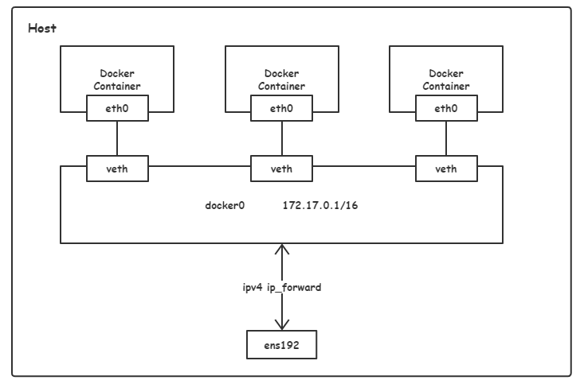
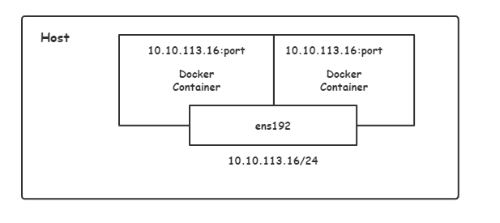
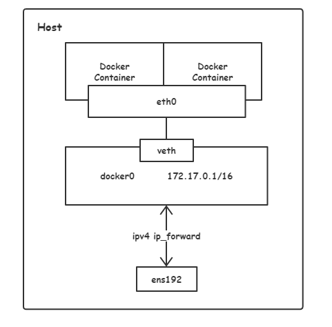

# 1.4 Docker 网络配置

Docker 有 4 种网络模式：

- Bridge 模式

- Host 模式

- Container 模式

- None 模式

我们主要说明 Bridge 模式和 Host 模式。Container 与 None 模式很少会使用，只做一些简单介绍。

## Bridge 模式

当 Docker 进程启动时，会在主机上创建一个名为 docker0 的虚拟网桥：

```bash
# CentOS 7 中使用 ifconfig，需要下载 net-tools 包
# 下载命令为 yum install -y net-tools
$ ifconfig
docker0: flags=4163<UP,BROADCAST,RUNNING,MULTICAST>  mtu 1500
        inet 172.17.0.1  netmask 255.255.0.0  broadcast 172.17.255.255
        inet6 fe80::42:23ff:fe4b:b4f0  prefixlen 64  scopeid 0x20<link>
        ether 02:42:23:4b:b4:f0  txqueuelen 0  (Ethernet)
        RX packets 167  bytes 14591 (14.2 KiB)
        RX errors 0  dropped 0  overruns 0  frame 0
        TX packets 201  bytes 22329 (21.8 KiB)
        TX errors 0  dropped 0 overruns 0  carrier 0  collisions 0
...
```

此主机上启动的 Docker 容器会连接到这个虚拟网桥上。虚拟网桥的工作方式和物理交换机类似，这样主机上所有容器就通过交换机连在了一个二层网络中：

1. 从 docker0 子网中分配一个 IP 给容器使用，并设置 docker0 的 IP 地址为容器的**默认网关**；

2. 在主机上创建一对虚拟网卡 veth pair 设备，Docker 将 veth pair 设备的一端放在新创建的容器中，并命名为 eth0（容器内的网卡）；

3. 另一端放在主机中，以 veth 开头加上一串哈希字符串来命名，并将这个网络设备加入到 docker0 网桥中。

我们来验证上述的说明：

首先我们先启动一个容器，Docker 启动容器时默认的网络模式即为 Bridge 模式：

```bash
$ docker run -itd --name busybox busybox /bin/sh
37d96cfa7d54d6d55f57591d0e0e288eb3494d37060ddbde3b84bb358731dc28
```

我们查看主机网络中多了一个 veth pair 虚拟网卡：

```bash
$ ifconfig
...
vethe0b273b: flags=4163<UP,BROADCAST,RUNNING,MULTICAST>  mtu 1500
        inet6 fe80::cc1d:91ff:fe3d:2e42  prefixlen 64  scopeid 0x20<link>
        ether ce:1d:91:3d:2e:42  txqueuelen 0  (Ethernet)
        RX packets 0  bytes 0 (0.0 B)
        RX errors 0  dropped 0  overruns 0  frame 0
        TX packets 8  bytes 656 (656.0 B)
        TX errors 0  dropped 0 overruns 0  carrier 0  collisions 0
```

然后可以通过 brctl show 命令查看 docker0 网桥中管理的网络设备：

```bash
# CentOS 7 中使用 brctl，需要下载 bridge-utils 包
# 下载命令为 yum install -y bridge-utils
$ brctl show
bridge name bridge id       STP enabled interfaces
docker0     8000.0242234bb4f0   no      vethe0b273b
```

接下来我们查看容器内的 eth0 网卡：

```bash
$ docker container exec busybox ifconfig
eth0      Link encap:Ethernet  HWaddr 02:42:AC:11:00:02  
          inet addr:172.17.0.2  Bcast:172.17.255.255  Mask:255.255.0.0
          UP BROADCAST RUNNING MULTICAST  MTU:1500  Metric:1
          RX packets:8 errors:0 dropped:0 overruns:0 frame:0
          TX packets:0 errors:0 dropped:0 overruns:0 carrier:0
          collisions:0 txqueuelen:0 
          RX bytes:656 (656.0 B)  TX bytes:0 (0.0 B)
...
```

最后，Docker 会为 docker0 网桥设备添加一条路由通过 iptables nat 表进行转发，这样主机和容器就能进行通信了：

```bash
$ route -n
Kernel IP routing table
Destination     Gateway         Genmask         Flags Metric Ref    Use Iface
172.17.0.0      0.0.0.0         255.255.0.0     U     0      0        0 docker0

$ docker container exec busybox route -n
Kernel IP routing table
Destination     Gateway         Genmask         Flags Metric Ref    Use Iface
0.0.0.0         172.17.0.1      0.0.0.0         UG    0      0        0 eth0
172.17.0.0      0.0.0.0         255.255.0.0     U     0      0        0 eth0
```

我们用一张图来描述 Bridge 模式：



## 自定义 Docker 网桥设备

我们现在想让容器网络之间互联，如果之前有用过 Docker，应该知道 `--link` 参数来使容器网络互联。但随着 Docker 网络的发展，现在已经不推荐使用 `--link` 这种方式了，因为在网络环境很复杂的情况下，使用 `--link` 描述这种复杂的网络关系会显得很稚嫩。

现在官方给出的建议是将容器加入自定义的 Docker 网络来连接多个容器，而不是使用 `--link` 参数。

我们先创建一个新的 Docker 桥接网络：

```bash
$ docker network create -d bridge my-net
31dcb22d213582152740df83bf5b9a5d3d30426b5d336eef276ff7702c875690
```
`-d` 参数指定 Docker 网络类型，有两种网络类型：

  - bridge：桥接网络，默认就是 bridge。

  - overlay：用于 Swarm mode，我们以后会讲到。

运行两个容器并将这两个容器连接到自定义的 my-net 网络：

```bash
$ docker container run -itd --name busybox-1 --network my-net busybox /bin/sh
0423df78b4b5066511e13b83a2fd55ff7dc51e600c8a743fb7268bea9e06c803

$ docker container run -itd --name busybox-2 --network my-net busybox /bin/sh
4ccd47271daa621232b97306f908e190c1d3264725e05b398da96870f94bf799

$ docker container ls
CONTAINER ID        IMAGE               COMMAND             CREATED             STATUS              PORTS               NAMES
4ccd47271daa        busybox             "/bin/sh"           2 minutes ago       Up 2 minutes                            busybox-2
0423df78b4b5        busybox             "/bin/sh"           2 minutes ago       Up 2 minutes                            busybox-1
```

我们在 busybox-1 与 busybox-2 容器内执行 Ping 命令来验证是否容器之间是互联的：

```bash
$ docker exec busybox-1 ping -c 4 busybox-2
PING busybox-2 (172.18.0.3): 56 data bytes
64 bytes from 172.18.0.3: seq=0 ttl=64 time=0.118 ms
64 bytes from 172.18.0.3: seq=1 ttl=64 time=0.117 ms
64 bytes from 172.18.0.3: seq=2 ttl=64 time=0.115 ms
64 bytes from 172.18.0.3: seq=3 ttl=64 time=0.143 ms

$ docker exec busybox-2 ping -c 4 busybox-1
PING busybox-1 (172.18.0.2): 56 data bytes
64 bytes from 172.18.0.2: seq=0 ttl=64 time=0.144 ms
64 bytes from 172.18.0.2: seq=1 ttl=64 time=0.121 ms
64 bytes from 172.18.0.2: seq=2 ttl=64 time=0.108 ms
64 bytes from 172.18.0.2: seq=3 ttl=64 time=0.112 ms
```

此时我们查看主机上的网卡，发现多了一个我们自定义的网桥设备，并且加入自定义网桥设备的容器会按照顺序来为容器分配 IP 地址：

```bash
$ ifconfig
br-31dcb22d2135: flags=4163<UP,BROADCAST,RUNNING,MULTICAST>  mtu 1500
        inet 172.18.0.1  netmask 255.255.0.0  broadcast 172.18.255.255
        inet6 fe80::42:ecff:fe4b:bb2f  prefixlen 64  scopeid 0x20<link>
        ether 02:42:ec:4b:bb:2f  txqueuelen 0  (Ethernet)
        RX packets 130  bytes 12144 (11.8 KiB)
        RX errors 0  dropped 0  overruns 0  frame 0
        TX packets 147  bytes 13798 (13.4 KiB)
        TX errors 0  dropped 0 overruns 0  carrier 0  collisions 0
```

所以自定义桥接网络（my-net）相比使用默认的桥接网络（docker0）有以下好处：

- **用户定义的桥接网络可在容器化应用程序之间提供更好的隔离和相互操作性**。因为连接到同一个自定义网桥的容器会自动的将所有端口互相暴露，并且不会向外界暴露任何端口，更不会向其他网桥中的容器暴露端口。这使得在同一个自定义网桥中的容器中的应用程序可以轻松的相互通信，还可以与其他网络中的容器进行隔离。

- **用户定义的桥接网络在容器之间提供自动的 DNS 解析**。默认情况下，容器之间只能使用 IP 地址进行相互访问，使用默认网桥，IP 地址有可能发生变化。如果加入了自定义网桥，容器可以通过容器名或者别名相互解析。我们在上述的实验中也验证了这一点。

## Host 模式

如果启动容器时使用的是 `host` 模式，那么这个容器将不会获得一个独立的 Network Namespace，而是和宿主机共用一个 Network Namespace。

Docker 不会为容器虚拟出独立的网卡、配置容器内的 IP 地址等，而是直接使用宿主机的 IP 地址和端口。但是容器的其他方面，比如文件系统、进程列表、主机名等还是和宿主机隔离的，仅仅是网络不再和宿主机隔离。

我们用一张图来描述 Host 模式：



我们来演示一下容器使用 Host 网络模式：

```bash
$ docker run -d --network host --name nginx --mount type=bind,src=/usr/sbin/ifconfig,dst=/usr/sbin/ifconfig nginx:1.14.2
88f9a6a878f8189ad325edc0787b922c085e3a4878556ebddbb19a8e03593dcb
```

> 为了在容器内能使用 `ifconfig` 命令，我把宿主机中的 `ifconfig` 程序挂载到容器内方便演示。

我们在容器内执行 `ifconfig` 命令查看下容器内的网络：

```bash
$ docker exec nginx ifconfig
...
docker0: flags=4099<UP,BROADCAST,MULTICAST>  mtu 1500
        inet 172.17.0.1  netmask 255.255.0.0  broadcast 172.17.255.255
        inet6 fe80::42:23ff:fe4b:b4f0  prefixlen 64  scopeid 0x20<link>
        ether 02:42:23:4b:b4:f0  txqueuelen 0  (Ethernet)
        RX packets 167  bytes 14591 (14.2 KiB)
        RX errors 0  dropped 0  overruns 0  frame 0
        TX packets 201  bytes 22329 (21.8 KiB)
        TX errors 0  dropped 0 overruns 0  carrier 0  collisions 0

ens192: flags=4163<UP,BROADCAST,RUNNING,MULTICAST>  mtu 1500
        inet 10.10.113.16  netmask 255.255.255.0  broadcast 10.10.113.255
        inet6 fe80::250:56ff:fe9f:bf65  prefixlen 64  scopeid 0x20<link>
        ether 00:50:56:9f:bf:65  txqueuelen 1000  (Ethernet)
        RX packets 281745  bytes 380258624 (362.6 MiB)
        RX errors 0  dropped 142  overruns 0  frame 0
        TX packets 248819  bytes 19673141 (18.7 MiB)
        TX errors 0  dropped 0 overruns 0  carrier 0  collisions 0
...
```

会发现和宿主机使用 `ifconfig` 命令查看到的内容完全相同，因为使用了 Host 模式，容器内的网络和宿主机不再进行隔离，共用一个网络空间。

这时不需要使用 `-p` 参数添加端口映射，会直接在宿主机上监听 80 端口了：

```bash
$ netstat -anptl | grep 80
tcp        0      0 0.0.0.0:80              0.0.0.0:*               LISTEN      25635/nginx: master
```

使用 Host 模式需要注意端口是否冲突，以及是否暴露了不想暴露的端口号导致一些安全性的问题。

## Container 模式

Container 模式会指定新创建的容器和已经存在的一个容器共享一个 Network Namespace，即共享一个网络空间，而不是和宿主机共享。

Docker 不会为新创建的容器创建自己的网卡，配置自己的 IP，而是和一个指定的容器共享 IP 地址等。同样，两个容器除了网络空间，其他的如文件系统、进程列表等还是隔离的。两个容器的进程可以通过 lo 网卡设备通信。

我们用一张图来描述 Container 模式：



这个模式在某些情况下表现出色，Kubernetes 就是采用这种模式将 Pod 下的所有容器共用一个网络空间，后续讲 Kubernetes 时我们会讲到。

## None 模式

使用 None 模式，Docker 容器拥有自己的 Network Namespace。但是 Docker 不会为容器进行任何网络配置。也就是说容器内没有网卡、IP、路由等信息。

## 总结

1. 配置 Docker 网络模式最常用的就是使用网桥模式，然后通过 `-p` 参数把容器内的端口映射至宿主机。

2. 如果我们想让一部分容器之间的网络共享，最好自定义一个桥接网络，然后把这些容器都加入到这个自定义桥接网络当中。

3. 如果你不想对容器进行网络隔离，可以使用 Host 模式将服务直接暴露在宿主机当中。

4. Container 模式与 Host 模式类似，只是不是共享宿主机的网络空间，而是共享另一个容器的网络空间。

5. None 模式说白了就是关闭容器的网络连接。

还有一些网络模式这里没有提到 比如说 overlay 模式用于 Docker Swarm，Macvlan 可以用来配置更加复杂的网络。现在用的很少，感兴趣的话可以在参考中的链接中参考下这两种网络模式，或者自己找些资料进行实验。

## 参考

- [Docker Use bridge networks](https://docs.docker.com/network/bridge/)

- [Docker Use host networking](https://docs.docker.com/network/host/)

- [Docker Use overlay networks](https://docs.docker.com/network/overlay/)

- [Docker Use Macvlan networks](https://docs.docker.com/network/macvlan/)

- [linux 网络虚拟化： macvlan](https://cizixs.com/2017/02/14/network-virtualization-macvlan/)

- [Docker Macvlan](https://www.cnblogs.com/bigberg/p/8656963.html)
