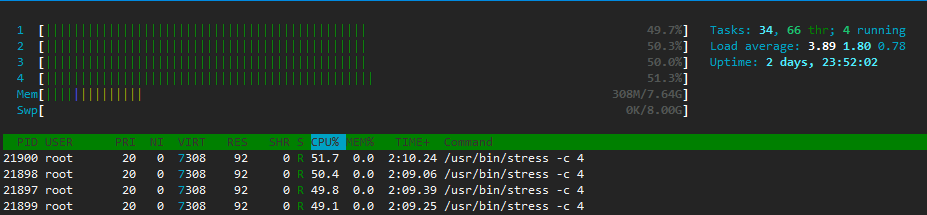
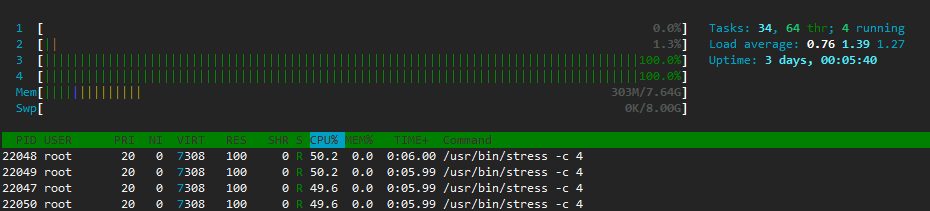

# 1.5 Docker 资源限制

使用 Docker 运行容器时，一台主机上可能运行多个容器，这些容器虽然相互隔离，但是底层却使用着相同的 CPU、内存和磁盘资源。如果不对容器使用的资源进行限制，那么容器之间会互相影响。可能导致各容器的资源分配不合理，甚至可能会因为某个容器占用资源过多导致主机资源耗尽，影响主机上所有的容器。

Docker 作为容器的管理者，自然提供了控制容器资源的功能，包括 CPU、内存和磁盘 IO。

我之前在介绍 Docker 时说过 Docker 是通过 Linux 内核的 CGroups 技术来做容器的资源限制。这里只介绍 Docker 如何来对容器进行资源限制，实现的细节可以参考第一章的链接，这里就不做介绍了。

## Stress 工具介绍

在介绍容器资源限制时需要用到压测工具进行测试，所以我们先介绍一个压力测试软件：Stress。

首先安装 Stress：

```bash
$ yum install -y stress
```

来看一下 Stress 命令帮助：

```bash
stress --help
'stress' imposes certain types of compute stress on your system

Usage: stress [OPTION [ARG]] ...
 -?, --help         show this help statement # 显示帮助信息
     --version      show version statement # 显示版本号
 -v, --verbose      be verbose # 详细模式
 -q, --quiet        be quiet # 静默模式，不显示运行信息
 -n, --dry-run      show what would have been done # 显示已经完成的指令执行情况
 -t, --timeout N    timeout after N seconds # 指定运行 N 秒后停止
     --backoff N    wait factor of N microseconds before work starts # 等待 N 微妙后开始运行
 -c, --cpu N        spawn N workers spinning on sqrt() # 产生 N 个进程 每个进程都反复不停的执行 sqrt() 计算随机数的平方根
 -i, --io N         spawn N workers spinning on sync() # 产生 N 个进程 每个进程反复调用 sync()，sync() 用于将内存上的内容写到硬盘上
 -m, --vm N         spawn N workers spinning on malloc()/free() # 产生 N 个进程,每个进程不断调用内存分配 malloc() 和内存释放 free() 函数
     --vm-bytes B   malloc B bytes per vm worker (default is 256MB) # 指定 malloc() 时内存的字节数 (默认 256MB)
     --vm-stride B  touch a byte every B bytes (default is 4096)
     --vm-hang N    sleep N secs before free (default none, 0 is inf) # 表示 malloc 分配的内存 N 秒后再使用 free() 释放掉
     --vm-keep      redirty memory instead of freeing and reallocating # 不释放内存资源
 -d, --hdd N        spawn N workers spinning on write()/unlink() # 产生 N 个进程，每个进程执行 write() 和 unlink () 函数
     --hdd-bytes B  write B bytes per hdd worker (default is 1GB) # 指定写的字节数，默认是 1GB

Example: stress --cpu 8 --io 4 --vm 2 --vm-bytes 128M --timeout 10s

Note: Numbers may be suffixed with s,m,h,d,y (time) or B,K,M,G (size).
```

来举一些例子：

我使用的主机 CPU 核心数为 4 核，我们产生 2 个 CPU 进程：

```bash
$ stress --verbose -c 2
stress: info: [18148] dispatching hogs: 2 cpu, 0 io, 0 vm, 0 hdd
stress: dbug: [18148] using backoff sleep of 6000us
stress: dbug: [18148] --> hogcpu worker 2 [18149] forked
stress: dbug: [18148] using backoff sleep of 3000us
stress: dbug: [18148] --> hogcpu worker 1 [18150] forked
```

我们在另一个终端上使用 `top` 命令查看结果：

```bash
$ top
...
%Cpu(s): 50.0 us,  0.1 sy,  0.0 ni, 49.9 id,  0.0 wa,  0.0 hi,  0.0 si,  0.0 st
...
  PID USER      PR  NI    VIRT    RES    SHR S  %CPU %MEM     TIME+ COMMAND                                                                       
18149 root      20   0    7308    100      0 R 100.0  0.0   1:23.92 stress                                                                     
18150 root      20   0    7308    100      0 R 100.0  0.0   1:23.92 stress 
```

发现，CPU 已经用了一半，每个 Stress 产生的进程都用了一个核心。

我们再来产生 4 个 I/O 进程，I/O 进程会不断把内存中的内容复制到磁盘上，这将消耗内核态的 CPU 资源：

```bash
$ stress --verbose -i 4
stress: info: [18262] dispatching hogs: 0 cpu, 4 io, 0 vm, 0 hdd
stress: dbug: [18262] using backoff sleep of 12000us
stress: dbug: [18262] --> hogio worker 4 [18263] forked
stress: dbug: [18262] using backoff sleep of 9000us
stress: dbug: [18262] --> hogio worker 3 [18264] forked
stress: dbug: [18262] using backoff sleep of 6000us
stress: dbug: [18262] --> hogio worker 2 [18265] forked
stress: dbug: [18262] using backoff sleep of 3000us
stress: dbug: [18262] --> hogio worker 1 [18266] forked

$ top
...
%Cpu(s):  0.3 us, 81.5 sy,  0.0 ni, 18.2 id,  0.0 wa,  0.0 hi,  0.0 si,  0.0 st
...
  PID USER      PR  NI    VIRT    RES    SHR S  %CPU %MEM     TIME+ COMMAND                                                     
18265 root      20   0    7308    100      0 R  76.4  0.0   2:21.05 stress
18266 root      20   0    7308    100      0 R  76.4  0.0   2:20.90 stress
18263 root      20   0    7308    100      0 R  76.1  0.0   2:20.62 stress
18264 root      20   0    7308    100      0 R  76.1  0.0   2:20.97 stress
```

可以发现 I/O 操作消耗的资源主要为内核态 CPU 资源。

接下来做内存的压力测试，我们产生 2 个 2G 的内存分配进程，并且不进行释放：

```bash
# 先看下这台服务器的内存
$ free -m
              total        used        free      shared  buff/cache   available
Mem:           7821         217        6997           8         606        7319
Swap:          8191           0        8191

$ stress --vm 2 --vm-bytes 2G --vm-keep
stress: info: [18312] dispatching hogs: 0 cpu, 0 io, 2 vm, 0 hdd

# 在另一个终端执行
$ free -m
              total        used        free      shared  buff/cache   available
Mem:           7821        4320        2894           8         606        3216
Swap:          8191           0        8191
```

发现一共占用了 4GB 的内存资源。

最后做磁盘读写的测试，我们产生 1 个磁盘写的进程，这个进程会不断的写，写完后在执行 Unlink 操作删除掉：

```bash
$ stress -d 1
stress: info: [18342] dispatching hogs: 0 cpu, 0 io, 0 vm, 1 hdd

# iostat 命令需要下载 sysstat 包，下载命令为 yum install -y sysstat
$ iostat -m  1
avg-cpu:  %user   %nice %system %iowait  %steal   %idle
           0.50    0.00   27.89    4.02    0.00   67.59

Device:            tps    MB_read/s    MB_wrtn/s    MB_read    MB_wrtn
sda             688.00         0.00       344.00          0        344
scd0              0.00         0.00         0.00          0          0
dm-0            688.00         0.00       344.00          0        344
dm-1              0.00         0.00         0.00          0          0
```

可以发现，磁盘写操作占用磁盘写资源。

### 如何在容器内使用 Stress 工具

我们可以在容器内挂载 `stress` 命令来达到在容器内进行压测的目的了：

```bash
# 我们先用一个 --cpus 参数来限制容器使用的 CPU 个数来测试
$ docker run --rm -it --cpus 0.5 --mount type=bind,src=/usr/bin/stress,dst=/usr/bin/stress centos:7 stress -c 4
stress: info: [1] dispatching hogs: 4 cpu, 0 io, 0 vm, 0 hdd

# 在另一个终端使用 top 命令
$ top
...
%Cpu(s): 12.6 us,  0.0 sy,  0.0 ni, 87.4 id,  0.0 wa,  0.0 hi,  0.0 si,  0.0 st
...
  PID USER      PR  NI    VIRT    RES    SHR S  %CPU %MEM     TIME+ COMMAND
19205 root      20   0    7308    100      0 R  12.6  0.0   0:09.87 stress
19206 root      20   0    7308    100      0 R  12.6  0.0   0:09.96 stress
19203 root      20   0    7308    100      0 R  12.3  0.0   0:09.89 stress
19204 root      20   0    7308    100      0 R  12.3  0.0   0:09.86 stress 
```

但是这样做有些麻烦，我们可以制作一个封装了 `stress` 命令的容器。这样，也省的在宿主机上下载 Stress 工具包了：


```bash
# 使用 tree 命令查看文件树需要下载 tree 包，下载命令为 yum install -y tree
$ tree
.
└── Dockerfile

0 directories, 1 file

$ cat Dockerfile 
FROM centos:7
MAINTAINER Peng.Gao <jugg.gao@qq.com>

RUN yum install -y epel-release && yum install -y stress

ENTRYPOINT ["/usr/bin/stress"]
CMD ["--help"]

$ docker image build -t jugggao/stress:1.0 .
Sending build context to Docker daemon  2.048kB
Step 1/5 : FROM centos:7
 ---> 1e1148e4cc2c
Step 2/5 : MAINTAINER Peng.Gao <jugg.gao@qq.com>
 ---> Using cache
 ---> 4129b0988155
...
Successfully tagged jugggao/stress:1.0

$ docker image ls
REPOSITORY          TAG                 IMAGE ID            CREATED             SIZE
jugggao/stress      1.0                 47f7f30d7bc6        7 minutes ago       317MB
```

使用 Dockerfile 来制作 Docker 镜像以后我会讲到，做完镜像以后在容器内使用 `stress` 命令就方便多了：

```bash
$ docker container run --rm -it --cpus 1 jugggao/stress:1.0 -c 2
stress: info: [1] dispatching hogs: 2 cpu, 0 io, 0 vm, 0 hdd

$ top
...
%Cpu(s): 25.0 us,  0.1 sy,  0.0 ni, 74.9 id,  0.0 wa,  0.0 hi,  0.0 si,  0.0 st
...
  PID USER      PR  NI    VIRT    RES    SHR S  %CPU %MEM     TIME+ COMMAND
21610 root      20   0    7308     96      0 R  50.2  0.0   1:33.93 stress
21611 root      20   0    7308     96      0 R  49.5  0.0   1:33.45 stress
```

因为这个镜像指定的入口（ENTRYPOINT）为 `/usr/bin/stress` 命令，所以我们连命令都不需要指定了，直接指定对应的参数即可。这个镜像我已经上传到我的 Docker Hub 中，想直接使用的话可以使用以下命令下载：

```bash
$ docker pull jugggao/stress:1.0
```

## CPU 限制

限制 CPU 资源的参数有很多：

```bash
--cpu-period  # 与 --cpu-quota 结合使用，用于指定 CPU 从新分配资源的时间周期，时间周期结束后，会对CPU 进行重新分配
--cpu-quota  # 与 --cpu-period 结合使用，于设定该容器在资源分配周期内占用 CPU 的时间
--cpu-rt-period  # --cpu-period 的微秒版，指定 CPU 重新分配资源的的时间周期 
--cpu-rt-runtime  # 在一个 CPU 资源分配周期内，优先保证容器的 CPU 使用的最大微秒数
-c, --cpu-shares  # 设置容器 CPU 权重，可以用于调整容器在单位分配周期内的资源优先使用比
--cpus  # 设置容器使用 CPU 的数量，用于快速设置容器对于 CPU 的占用
--cpuset-cpus  # 将容器绑定在指定的 CPU 上运行，可以设置范围（0-3），也可以绑定多个（ 0,2）
--cpuset-mems  # 将容器绑定在指定的内存节点，每个内存节点和 NUMA 节点一一对应 
```

这里只介绍 `--cpus` 与 `--cpuset-cpus` 这两个参数。

### 限制容器最多能使用的 CPU 核数

Docker 提供了 `--cpus` 参数可以限定容器能使用的 CPU 核数。这个功能可以让我们精确的设置 CPU 容器使用量。相比于 `--cpu-period` 参数与 `--cpu-quota` 参数结合使用，这个参数也更容易理解。

`--cpus` 后面跟一个浮点数，代表容器最多可以使用的 CPU 核数，可以精确到小数点二位，也就是说容器最小可以设置最多使用 0.01 核 CPU。比如我们现在有 4 个核心，限制容器最多能使用 2 个核心：

```bash
$ docker container run --rm -it --cpus 2 jugggao/stress:1.0 -c 4
stress: info: [1] dispatching hogs: 4 cpu, 0 io, 0 vm, 0 hdd

# 由于容器名是随机的，查询一下容器的 ID
$ docker container ls
CONTAINER ID        IMAGE                COMMAND                  CREATED             STATUS              PORTS               NAMES
385ddca16804        jugggao/stress:1.0   "/usr/bin/stress -c 4"   6 seconds ago       Up 5 seconds                            gracious_keldysh

# 在另一个终端使用 docker container stats 查询容器占用的资源
$ docker container stats 385ddca16804
CONTAINER ID        NAME                CPU %               MEM USAGE / LIMIT   MEM %               NET I/O             BLOCK I/O           PIDS
385ddca16804        gracious_keldysh    199.57%             192KiB / 7.638GiB   0.00%               656B / 0B           24.6kB / 0B         5

# 我们使用 htop 更人性化显示主机资源使用情况
$ htop
```



我们在容器内启动了 4 个 CPU 进程，如果不做限制的话，这个容器会把宿主机上的 CPU 资源全部吃完。但是我们添加了 `--cpus 2` 这个限制，无论容器启动多少个进程，最多只能占用宿主机的 2 个 cpu 核心数，即宿主机 CPU 资源的 50%。

### 限制容器运行在固定的 CPU 核心上

现在的服务器或个人电脑都会有多个 CPU，Docker 也允许调度资源的时候限制容器运行在哪个 CPU 核心上。

比如我的主机有 4 个核心（0,1,2,3），现在有一些不太重要的容器（比如说需要一些大量的 I/O 操作，不需要执行的很快，优先级不是很高），我希望这些不太重要的容器共用最后 2 个核心，达到不影响其他重要的容器的目的。那么我们可以通过 `--cpuset-cpus` 参数让这些容器只运行在固定的 CPU 核心上：

```bash
$ docker container run --rm -it --cpuset-cpus 2,3 jugggao/stress:1.0 -c 4
stress: info: [1] dispatching hogs: 4 cpu, 0 io, 0 vm, 0 hdd

$ htop
```



我们在容器内启动的 CPU 进程只在 2 和 3 这两个 CPU 核心上运行了。

我们还可以指定一段 CPU 核心的范围：

```bash
$ docker container run --rm -it --cpuset-cpus 2-3 jugggao/stress:1.0 -c 4
```

## 内存限制

默认情况下，Docker 不会对容器的内存进行限制，容器可以使用主机提供的所有内存。这是一件比较危险的事情，我在工作中遇见了不少代码内存泄漏导致系统主机内存耗尽，导致服务不可用。前段时间公司的一台阿里云服务器中了恶意程序不断的运行 Crontab 定时任务进行内存恶意消耗导致 OOM ，系统崩溃。 

> 注： Docker 会设置 Docker Daemon 的 OOM（Out Of Memory）值，使其在内存不足的时候被杀死的优先级降低，因为如果 Docker Daemon 由于 OOM 的问题被 Linux 内核干掉了，那么这台服务器所有容器都不能再使用了，所以在内存不足的时候 Docker Daemon 应该排在容器进程后面被杀死才比较合理。

对于这种情况，我们可以为每个容器设置内存的使用上限，一旦超过这个上限，容器就会被杀死，而不是耗尽主机的内存资源。

注意，限制内存上限虽然能保护主机，但也可能会伤害容器内的服务。如果为服务设置的内存上限太小，会导致服务还在正常工作的时候就会因为 OOM 被 Kill 掉；如果设置的过大，会因为调度器算法浪费内存。

因此，合理的做法包括：

- 为应用做内存压力测试，理解业务正常时需求的使用内存资源量，然后再为容器做内存限制;

- 尽量保证主机的资源充足，一旦通过监控发现资源不足，就进行扩容或者对容器进行迁移（这点 Kubernetes 可以优雅的解决）;

- 进来不要使用 Swap 内存交换空间，Swap 交换空间的使用会导致内存计算复杂，对调度器非常不友好（Kubernetes 默认是必须禁用 Swap 交换空间的）。

Docker 限制容器内存使用量有以下参数：

```bash
-m, --memory  # 限制容器的内存使用量
--memory-reservation  # 软限制容器的内存使用量，达到软限制的容器不会进行 OOM，但是如果 Docker 发现主机内存不足，会执行 OOM 操作优先 Kill 掉容器里的进程。这个值必须小于 --memory 设置的值
--memory-swap  # 限制容器的总内存的使用量，包括物理内存和交换分区
--memory-swappiness  # 默认情况下，主机可以把容器使用的匿名页（Anonymous Page）Swap 出来，你可以设置一个 0-100 之间的值，代表允许 Swap 出来的比例。默认情况下这个值会从宿主机继承
--kernel-memory  # 限制容器的内核内存使用量
--oom-kill-disable  # 默认情况下，如果内存不足，内核或终止容器内的进程。如果设置了此参数，内存不足时也不会终止容器内的进程，此时系统会 Kill 系统进程用于释放进程。这个参数比较危险，慎用。
```

这里只介绍 `-m` 参数与 `--memory-swap` 参数。

### 限制容器内存使用量

Docker 提供了 `-m` 或 `--memory` 参数来限制容器内存最大的使用量。我们来启动一个 Stress 容器并启动占用 4G 的内存分配进程，并把这个容器的内存上限限制为 2G，观察一下结果：

```bash
$ docker container run --rm -it  -m 2g  jugggao/stress:1.0 --vm 2 --vm-bytes 2G --vm-keep
stress: info: [1] dispatching hogs: 0 cpu, 0 io, 2 vm, 0 hdd
stress: FAIL: [1] (415) <-- worker 8 got signal 9
stress: WARN: [1] (417) now reaping child worker processes
stress: FAIL: [1] (451) failed run completed in 4s
```

容器内的进程由于超过了设置的内存上限导致 OOM，进程被 Kill 掉（信号 9）。

### 限制容器内交换空间使用量

Docker 提供了 `--memory-swap` 参数来配置容器内的物理内存和交换空间总和的使用上限。关于这个参数的用法如下：

- 如果设置了 `--memory-swap`  并且为正整数，那么也必须设置 `-m` 或 `--memory` 的值;

- `--memory-swap` 的值必须大于 `--memory` 的值，并且容器可用交换分区为：「交换分区」 = 「--memory-swap 设置的值」 - 「--memory-swap 设置的值」。比如设置了 `--memory 2g --memory-swap 6g`，容器内的可用交换分区为 4G;

- `--memory-swap` 的值为 0；或 `--memory-swap` 的值与 `--memory` 的值相同；或未指定 `--memory-swap` 参数，表示禁用容器内的交换分区使用;

- `--memory-swap` 的值为 -1 表示不限制容器内交换分区的使用，主机有多少 Swap 交换空间，容器就能用多少。

我们给容器分配 4G 的交换分区的使用来在看下是否还会导致容器内的进程因为 OOM 被 Kill 掉：

```bash
$ docker container run --rm -it  -m 2g  --memory-swap 6g jugggao/stress:1.0 --vm 2 --vm-bytes 2G --vm-keep
stress: info: [1] dispatching hogs: 0 cpu, 0 io, 2 vm, 0 hdd

$ docker container ls 
CONTAINER ID        IMAGE                COMMAND                  CREATED             STATUS              PORTS               NAMES
62f39d1bed21        jugggao/stress:1.0   "/usr/bin/stress --v…"   48 seconds ago      Up 47 seconds                           unruffled_jepsen

$ docker container stats 62f39d1bed21
CONTAINER ID        NAME                CPU %               MEM USAGE / LIMIT   MEM %               NET I/O             BLOCK I/O           PIDS
62f39d1bed21        unruffled_jepsen    50.68%              2GiB / 2GiB         99.99%              656B / 0B           13.7GB / 10.4GB     3

$ free -m
              total        used        free      shared  buff/cache   available
Mem:           7821        2296        5178           8         346        5245
Swap:          8191        2051        6140
```

可以看到，容器内使用的最大内存已经达到了 2G，并且使用了 2G 的交换分区内存。

不建议为容器配置交换分区，交换分区性能很低。可以在宿主机上配置 Swap 提供缓冲以防止系统内存资源耗尽而导致的系统崩溃。


## 磁盘限制

对于磁盘来说，考量的参数是磁盘的容量与读写速度。因此对容器的磁盘限制也应该从这两个指标出发。

Docker 目前支持对磁盘读写速度进行限制，但是并不支持对磁盘容量进行限制，一旦磁盘挂载到容器里，容器就能够使用磁盘所有的容量。

### 限制磁盘读写速率

Docker 提供了两个参数来限制容器内磁盘的读写速率：

- `--device-read-bps`：限制磁盘读取速率;

- `--device-write-bps`：限制磁盘写入速率。

上面两个参数的值都是磁盘对应的速率，格式为 `<deivce-path>:<limit>[unit]`，其中 `<device-path>` 表示磁盘所在位置，`<limit>` 表示限制的速率，后面的单位 `[unit]` 可以为 kb、mb、和 gb。

比如我们把一个容器的磁盘设备读速率限制为 5 MB/s：

```bash
$ docker container run --rm  -it  --device-read-bps /dev/sda:5mb centos:7 \
    dd iflag=direct,nonblock if=/dev/zero of=/dev/null bs=5M count=10
10+0 records in
10+0 records out
52428800 bytes (52 MB) copied, 50.0026 s, 1.0 MB/s
```

可以看到，从盘读取 50M 的数据，一共花费了 50s 左右，每秒读取 1MB。

把磁盘的写速率限制为 1 MB/s：

```bash
$ docker container run --rm -it --device-write-bps /dev/sda:1mb centos:7 \
    dd oflag=direct,nonblock if=/dev/zero of=/tmp/test bs=5M count=10
10+0 records in
10+0 records out
52428800 bytes (52 MB) copied, 50.0059 s, 1.0 MB/s
```

可以看到，写入 50M 的数据到磁盘空间，一共花费了 50s 左右，每秒读取 1MB。

### 限制磁盘读写频率

Docker 还提供了两个参数来限制磁盘的读写频率：

- `--device-read-iops`：磁盘每秒最多可以执行多少 IO 读操作；

- `--device-write-iops`：磁盘每秒最多可以执行多少 IO 写操作。

上面两个参数的值都是磁盘以及对应的 IO 上限，格式为 `<device-path>:<limit>`，`<limit>` 为正整数，表示磁盘 IO 上限数。

我们来限制容器磁盘设备每秒最多读 100 次：

```bash
$ docker container run -it --device /dev/sda:/dev/sda --device-read-iops /dev/sda:100 centos:7 \
    dd iflag=direct,nonblock if=/dev/sda of=/dev/null bs=1k count=1000
1000+0 records in
1000+0 records out
1024000 bytes (1.0 MB) copied, 9.91246 s, 103 kB/s
```

因为我们制定了 bs 这个参数为 1k，表示一次读写 1K 的数据，所以我们指定一共要读 1000 次，一共用了 10s，符合预期。

`--device-write-iops` 参数与 `--device-read-iops` 参数类似，就不再说明。

## 总结

Docker 中可以限制的资源有：

1. CPU 限制，主要使用 `--cpus` 参数来限制容器最多使用的 CPU 核心数。

2. 内存限制，主要使用 `-m` 参数来限制容器最多能使用的内存量。使用内存限制的时候一定要考虑业务实际内存的使用量再根据实际情况进行限制。

3. 磁盘限制，主要使用 `--device-read-bps` 参数与 `--device-write-bps` 参数来限制容器内磁盘读写速率。


## 参考

- [Limit a container's resources](https://docs.docker.com/config/containers/resource_constraints/#--memory-swappiness-details)

- [Docker run reference](https://docs.docker.com/engine/reference/run/)

