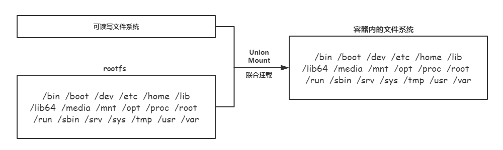
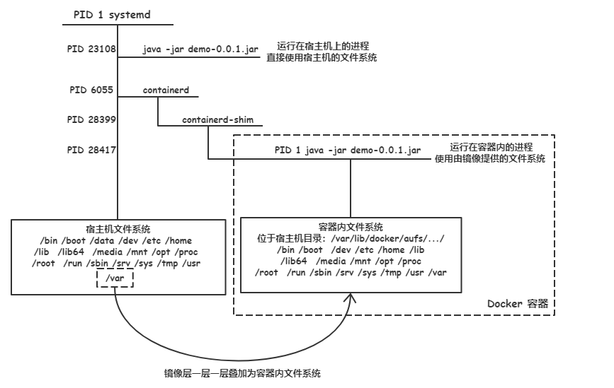
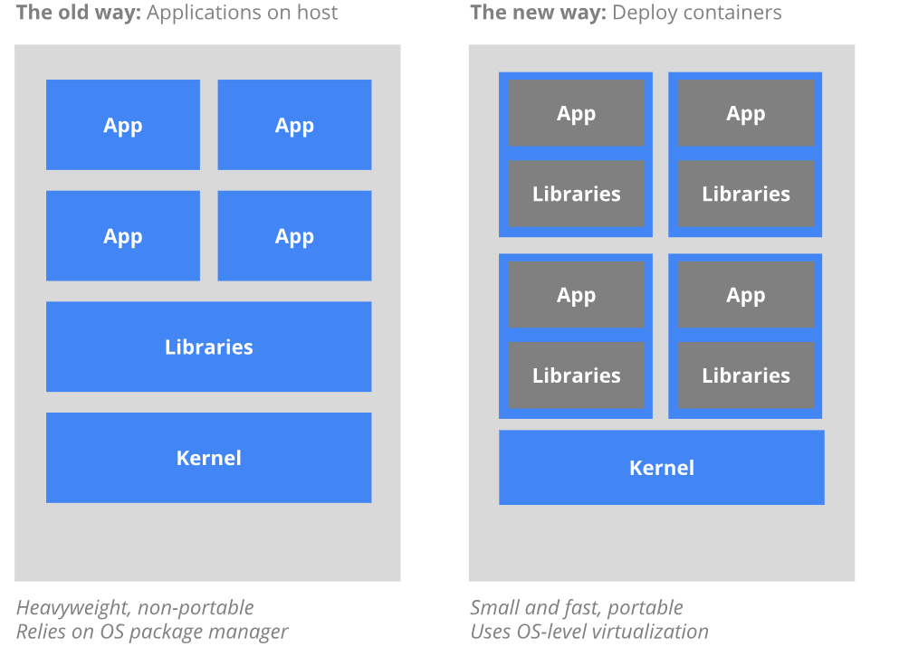
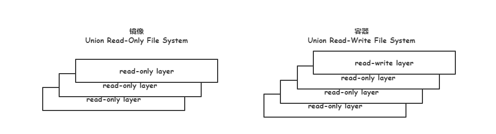

# 1.8 理解镜像的构成

对于开发者或者 Docker 维护者而言，经常需要根据我们的需求来定制镜像。所以我们会经常和镜像打交道。

之前我们使用过 `docker commit` 命令定制过属于自己的镜像。但是，不要使用 `docker commit` 定制镜像，定制镜像应该使用 `Dockerfile` 来完成。

在介绍 `Dockerfile` 之前，我们先来理解镜像是怎么构成的，理解了镜像的构成后再使用 `Dockerfile` 构建镜像就容易多了。

## Docker 镜像简介

Docker 镜像是一个只读的 Docker 容器模板，含有启动 Docker 容器所需的文件系统结构及其内容。

Docker 镜像的文件内容以及一些运行 Docker 容器的配置文件组成了 Docker 容器的静态文件系统运行环境：**rootfs**。

可以这么理解，Docker 镜像是 Docker 容器的静态视角，Docker 容器是 Docker 镜像的运行状态。

首先你需要明确以下两点：

- 容器看起来像一个完整的操作系统就是因为镜像为容器提供了独立的文件系统，即 rootfs。

- 镜像是分层的，然后在使用联合挂载技术将这些镜像层组成一个完整的 rootfs，最后再使用联合挂载技术挂载一层可读写层，就形成了容器内我们所看见的统一的文件系统视图。

## ROOTFS 文件系统

rootfs 是由镜像所提供的，是 Docker 容器在启动时内部进程可见的文件系统，即 Docker 容器的根目录。

rootfs 通常包含一个操作系统运行所需的文件系统，例如可能包含典型的类 Unix 操作系统中的目录系统，如 /dev、/proc、/bin、/etc、/lib、/usr、/tmp 以及运行 Docker 容器所需的配置文件、工具等。

rootfs 为只读模式。在挂载完毕之后，利用联合挂载（Union Mount）技术在已有的只读 rootfs 上再挂载一个读写层。这样，可读写层处于 Docker 容器文件系统的最顶层，其下可能联合挂载多个只读层，只有在 Docker 容器运行过程中文件系统发生变化时，才会把变化的文件内容写到可读写层，并**隐藏**只读层中的老版本文件。

我们用一张图来描述容器使用 rootfs 文件系统：



我们来进行验证：

宿主机的进程（没有使用 Chroot 改变进程根目录）将会看到宿主机的文件系统，我们在宿主机运行一个 Java 程序：

```bash
$ nohup java -jar demo-0.0.1.jar > /dev/null 2>&1  &
[2] 23108

# 查看 java 进程的根目录
$ ls /proc/23108/root/
bin  boot  data  dev  etc  home  lib  lib64  media  mnt  opt  proc  root  run  sbin  srv  sys  tmp  usr  var

$ du -sh --exclude="/proc/23108/root/proc/*" /proc/23108/root/
2.8G    /proc/23108/root/
```

容器内的进程只能看到由镜像联合挂载的 rootfs 文件系统，我们在容器内运行一个 java 程序：

```bash
$ docker container run -d --name hello hello:0.1
1aa9628ae3d6cfa15aae907f7eeda4b77468725719d5b40e9aa5303a11181063

$ ps -ef | grep -v grep | grep java
root     28417 28399 31 00:09 ?        00:00:06 java -jar /demo-0.0.1.jar

$ ls /proc/28417/root/
bin  boot  demo-0.0.1.jar  dev  etc  home  lib  lib64  media  mnt  opt  proc  root  run  sbin  srv  sys  tmp  usr  var

$ du -sh --exclude="/proc/28417/root/proc/*" /proc/28417/root/
291M    /proc/28417/root/
```

可以发现容器内的整个文件系统要比宿主机的文件系统小的多。

我们用一幅图来比较运行在宿主机的进程与运行在容器内的进程：



现在我们再来看官方的图应该就能理解宿主机的进程和容器内的进程的区别了，也应该能理解镜像到底是什么？就是给容器内的进程提供一个运行环境的：



这幅图右边的 Libraries 就是一个操作系统所需要的目录及文件，再把我们需要的程序放进去（比如说 Java 程序）。也就是我们刚才所说的 rootfs 文件系统，而这个 rootfs 操作系统就是由 Docker 镜像所提供的。


## Docker 镜像的分层

Docker 镜像是采用分层方式构建的，每个镜像由一系列的「镜像层」构成。

Docker 镜像分层结构是 Docker 镜像轻量的主要原因。当需要修改容器镜像内的某个文件时，只对处于上方的读写层进行变动，不覆盖读写层下面已有的文件系统的内容，已有文件在只读层中的原始版本依然会存在，但会被隐藏。当你使用 `Docker commit` 或使用 `Dockerfile` 在原始镜像的基础上生成新的镜像时，保存的内容仅为最上层的读写层，相当于多了一个「镜像层」。

分层的目的就是为了在不同的镜像之间共享镜像层达到节省磁盘空间的目的。

我们用一张图来描述镜像的分层：



我们来验证镜像的分层：

查看系统中的镜像：

```bash
$ docker image ls
REPOSITORY          TAG                 IMAGE ID            CREATED             SIZE
wema/zuul           0.1                 7baa6ec0606d        2 days ago          338MB
wema/users          0.1                 0c6721ba85c8        2 days ago          337MB
wema/third-party    0.1                 4d112e570e6c        2 days ago          346MB
wema/teacher        0.1                 d96228e1ac53        2 days ago          336MB
wema/eureka         0.1                 4ff81306b255        2 days ago          324MB
wema/course         0.1                 ce2594635709        2 days ago          339MB
wema/company        0.1                 b01a31292858        2 days ago          336MB
tomcat              8                   168588387c68        13 days ago         463MB
mysql               5.7                 e47e309f72c8        2 weeks ago         372MB
java                8                   719e41f3e37b        3 months ago        280MB
redis               3                   87856cc39862        4 months ago        76MB
```

由于 wema/zuul:0.1、wema/eureka:0.1 等这些封装了 Java 程序的镜像都是使用 java:8 这个镜像进行制作的，所以它们是共享了一些镜像层的：

```bash
$ docker image history java:8
IMAGE               CREATED             CREATED BY                                      SIZE                COMMENT
719e41f3e37b        3 months ago        |0 /bin/sh -c yum install -y tar gzip &&    …   162MB               
<missing>           3 months ago        /bin/sh -c #(nop)  ENV JAVA_HOME=/usr/java/d…   0B                  
<missing>           3 months ago        /bin/sh -c #(nop)  MAINTAINER Aurelio Garcia…   0B                  
<missing>           3 months ago        /bin/sh -c #(nop)  CMD ["/bin/bash"]            0B                  
<missing>           3 months ago        /bin/sh -c #(nop) ADD file:455ccf156d2b27cef…   117MB               
<missing>           5 months ago        /bin/sh -c #(nop)  MAINTAINER Oracle Linux P…   0B 


$ docker image history wema/zuul:0.1
IMAGE               CREATED             CREATED BY                                      SIZE                COMMENT
7baa6ec0606d        2 days ago          /bin/sh -c #(nop)  ENTRYPOINT ["java" "-jar"…   0B                  
1c5f0c7d9c6a        2 days ago          /bin/sh -c #(nop) ADD file:53656c57d8b3ddca1…   58.3MB              
719e41f3e37b        3 months ago        |0 /bin/sh -c yum install -y tar gzip &&    …   162MB               
<missing>           3 months ago        /bin/sh -c #(nop)  ENV JAVA_HOME=/usr/java/d…   0B                  
<missing>           3 months ago        /bin/sh -c #(nop)  MAINTAINER Aurelio Garcia…   0B                  
<missing>           3 months ago        /bin/sh -c #(nop)  CMD ["/bin/bash"]            0B                  
<missing>           3 months ago        /bin/sh -c #(nop) ADD file:455ccf156d2b27cef…   117MB               
<missing>           5 months ago        /bin/sh -c #(nop)  MAINTAINER Oracle Linux P…   0B 

$ docker image history wema/eureka:0.1
IMAGE               CREATED             CREATED BY                                      SIZE                COMMENT
4ff81306b255        2 days ago          /bin/sh -c #(nop)  ENTRYPOINT ["java" "-jar"…   0B                  
792aed369025        2 days ago          /bin/sh -c #(nop) ADD file:cb8542050897d1ff9…   44.1MB              
719e41f3e37b        3 months ago        |0 /bin/sh -c yum install -y tar gzip &&    …   162MB               
<missing>           3 months ago        /bin/sh -c #(nop)  ENV JAVA_HOME=/usr/java/d…   0B                  
<missing>           3 months ago        /bin/sh -c #(nop)  MAINTAINER Aurelio Garcia…   0B                  
<missing>           3 months ago        /bin/sh -c #(nop)  CMD ["/bin/bash"]            0B                  
<missing>           3 months ago        /bin/sh -c #(nop) ADD file:455ccf156d2b27cef…   117MB               
<missing>           5 months ago        /bin/sh -c #(nop)  MAINTAINER Oracle Linux P…   0B  
```

可以看到  wema/zuul:0.1 和 wema/eureka:0.1 这两个镜像共享了 6 层镜像层。

所以 Docker 镜像并没有占用很大的空间：

```bash
docker system df
TYPE                TOTAL               ACTIVE              SIZE                RECLAIMABLE
Images              11                  10                  1.587GB             279.8MB (17%)
...
```

现在你也应该能理解为什么当你在一个容器的读写层进行改变并生成新的镜像时，为什么不会覆盖下面已有的只读层，而是添加一层镜像层。因为其他镜像可能需要需要共享。

分层也能帮助我们更好的排查镜像制作中的错误。如果制作的镜像出了问题，我们只需要在出问题的前一层镜像的基础上重新制作即可。

现在再来看 Union FS（联合文件系统）与 Union Mount（联合挂载）技术。也容易理解多了：联合挂载就是用于将多个镜像层的文件系统挂载到一个挂载点来实现一个统一文件系统视图，形成联合文件系统。是下层存储驱动（如 Aufs、Overlay2）实现分层合并的方式。

## 总结

1. 挂载在容器根目录上、用来为容器进程提供隔离后执行环境的文件系统，就是 Docker 镜像。这个文件系统更专业的名称为：rootfs（根文件系统）。

2. 有了镜像提供 rootfs，Docker 只需要切换进程的根目录（Change Root，可以参考 Chroot 技术），然后再启动 Linux Namespace 隔离（包括进程隔离、挂载隔离、网络隔离、主机名隔离），设置指定的 Cgroup 限制参数。这样一个完成的容器就诞生了。

3. rootfs 只是一个操作系统所包含的文件、配置和目录，并不包括操作系统的内核（bootfs 包含了 BootLoader 和 Kernel ），在Linux操作系统中，这两部分是分开存放的，操作系统只有在开机启动时才会加载指定版本的内核。所以说，rootfs 只包括了操作系统的 「躯壳」，并没有包括操作系统的「灵魂」。

4. 由于 rootfs 里打包的不只是应用，而是整个操作系统的文件和目录，也就意味着，应用以及它运行所需要的所有依赖，都被封装在了一起。所以容器才有了一个被反复宣传至今的重要特性：一致性。即无论在本地、云端，还是在一台任何地方的机器上，用户只需要解压打包好的容器镜像，那么这个应用运行所需要的完整的执行环境就被重现出来了。

5. Docker 镜像之所以轻量，是因为通常我们制作的镜像只满足容器内运行的程序所依赖的目录文件，并且内核是使用宿主机的内核。所以有很多官方镜像为了足够精简，下载的官方镜像通常少了很多常用的命令。如果需要的话就使用 `Dockerfile` 在官方的镜像的基础上再加工。

6. 容器启动后，最上层的读写层只是临时的。如果不使用 `docker commit` 将容器进行提交为镜像，这个容器删除后，读写层随之被删除。

7. 我们在来回顾一下第一章介绍的容器的实现，Docker 容器看起来像一个完整的操作系统主要是因为：rootfs 为容器提供了独立的根目录；Linux Pid Namespace（进程隔离）技术让容器内的进程拥有一个全新的进程空间；Linux Network Namespace（网络隔离）技术让容器拥有自己独立的网络栈、路由表、防火墙规则、Socket等；Linux hostname Namespace（主机名隔离）技术让容器拥有自己独立的主机名；Linux User Namespace（用户隔离）技术让容器拥有自己独立的用户；Linux Mount Namespace（挂载隔离）技术让容器拥有自己独立的挂载的设备，还有一些其他的技术这里就不进行介绍了。**这些技术实际上修改了应用进程看待整个计算机的「视图」，即容器内进程的「视线」被操作系统做了限制，只能「看到」某些指定的内容。无论怎么「移花接木」，容器终究也只是进程而已**。

## 参考

- [Docker About storage drivers](https://docs.docker.com/storage/storagedriver/)

- [Docker Use the OverlayFS storage driver](https://docs.docker.com/storage/storagedriver/overlayfs-driver/)


