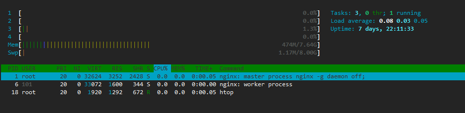
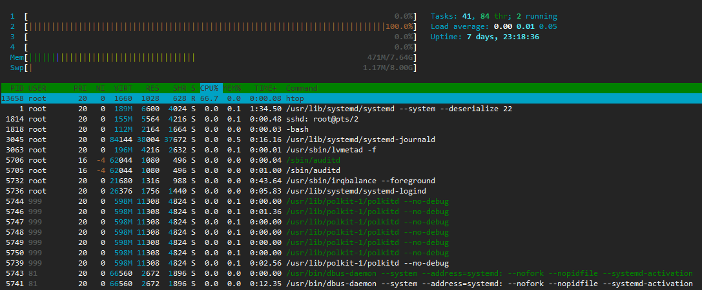
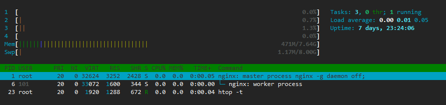

# 1.8 Docker 使用 Dockerfile 自制镜像

我们之前使用过 `docker commit` 来自制镜像，但为什么不要使用 `docker commit` 而是使用 Dockerfile 来自制进行呢？

首先，观察之前制作镜像时使用 `docker container diff` 命令输出的结果：

```bash
$ docker container diff nginx
C /usr
C /usr/share
C /usr/share/nginx
C /usr/share/nginx/html
C /usr/share/nginx/html/index.html
C /root
A /root/.bash_history
C /var
C /var/cache
C /var/cache/nginx
A /var/cache/nginx/client_temp
A /var/cache/nginx/fastcgi_temp
A /var/cache/nginx/proxy_temp
A /var/cache/nginx/scgi_temp
A /var/cache/nginx/uwsgi_temp
C /run
A /run/nginx.pid
```

发现除了真正想要修改的 `/usr/share/nginx/html/index.html` 文件除外，还有很多文件被添加或者修改了，比如说缓存文件、Pid 文件等等。这还只是最简单的操作，如果是安装软件包、编译构建，那会有大量无关的内容被添加进来，如果不注意清理，将会导致镜像很臃肿。

此外，使用 `docker commit` 自制镜像，意味着所有对镜像的操作都是黑箱操作：

```bash
$ docker image history jugggao/nginx:1.0
IMAGE               CREATED              CREATED BY                                      SIZE                COMMENT
62f1198899f3        About a minute ago   nginx -g daemon off;                            92B                 修改默认首页
...
```

并不能看到实际执行的命令，这种镜像也被称为**黑箱镜像**。就是除了制作镜像的人知道执行过什么命令、怎么生成的镜像（说不定还忘了），别人根本无从得知。所以维护黑箱镜像的工作是很痛苦的。

而且，之前介绍过镜像是分层存储的。除当前层外，之前的每一层都是不会发生改变的，换句话说，任何修改的结果仅仅是在当前层进行标记、添加、修改，而不会改动上一层。如果使用 `docker commit` 制作镜像，以及后期修改的话，每一次修改都会让镜像更加臃肿一次，所删除的上一层的东西并不会丢失，会一直如影随形的跟着这个镜像，即使根本无法访问到。这会让镜像更加臃肿。

所以，我们需要把每一层修改、安装、构建、操作的命令都写入一个脚本，用这个脚本来构建、定制镜像，那么之前提及的无法重复的问题、镜像构建透明性的问题、体积的问题就都会解决。这个脚本就是 Dockerfile。

Dockerfile 是一个文本文件，期内包含了一条条**指令**，**每一条指令构建一层镜像层**，因此每一条指令的内容，就是描述该层应当如何构建。

比如我们最多使用的自制镜像：

在一个空白目录，新建一个文本文件，名为 Dockerfile。Dockerfile 内容如下：

```bash
FROM jugggao/java:8-jre

COPY demo-0.0.1.jar /demo-0.0.1.jar

CMD ["java","-jar","/demo-0.0.1.jar"]
```

然后我们就可以使用 `docker image build` 命令来构建镜像了：

```bash
$ tree
.
├── demo-0.0.1.jar
└── Dockerfile

0 directories, 2 files

$ docker image build -t java-demo:0.1 .
Sending build context to Docker daemon  16.72MB
Step 1/3 : FROM jugggao/java:8-jre
 ---> 719e41f3e37b
Step 2/3 : ADD demo-0.0.1.jar /demo-0.0.1.jar
 ---> Using cache
 ---> 243662a30000
Step 3/3 : CMD ["java","-jar","/demo-0.0.1.jar"]
 ---> Using cache
 ---> 328d450440c1
Successfully built 328d450440c1
Successfully tagged java-demo:0.1
```

这个 Dockerfile 很简单，一共用到了 3 个指令：`FROM`、`COPY` 和 `CMD`。

我们接下来分别介绍 Dockerfile 的常用指令。

## FROM 指定基础镜像

所谓定制镜像，一定是以一个镜像为基础，在其上进行定制（添加镜像层）。

我们之前做容器健康检查时发现 Nginx 容器中没有 `curl` 命令，所需需要在其基础上添加 `curl` 工具：

```Dockerfile
FROM nginx:1.14.2

RUN apt-get update -y && apt-get install -y curl
```

`FROM` 指令就是指定基础镜像，因此一个 Dockerfile 中 `FROM` 是必备的指令，并且必须是第一个。

在 [Docker Hub](https://hub.docker.com/) 上有很多质量非常高的官方镜像：

- 有可以直接拿来使用的服务类镜像：[Nginx](https://hub.docker.com/_/nginx)、[Tomcat](https://hub.docker.com/_/tomcat/)、[Php](https://hub.docker.com/_/php/)、[Httpd](https://hub.docker.com/_/httpd/)、[Wordpress](https://hub.docker.com/_/wordpress)、[Server JRE](https://hub.docker.com/_/oracle-serverjre-8)、[MySQL](https://hub.docker.com/_/mysql)、[Redis](https://hub.docker.com/_/redis)、[MongoDB](https://hub.docker.com/_/mongo) 等；

- 还有一些方便开发、构建、运行各种语言应用的镜像：[Node](https://hub.docker.com/_/node)、[Openjdk](https://hub.docker.com/_/openjdk)、[Python](https://hub.docker.com/_/python)、[Golang](https://hub.docker.com/_/golang)、[Ruby](https://hub.docker.com/_/ruby) 等；

- 如果没有找到对应的服务镜像，官方还提供了一些更为基础的操作系统镜像可以在其基础上自制专属的服务镜像：[Ubuntu](https://hub.docker.com/_/ubuntu/)、[Debian](https://hub.docker.com/_/debian/)、[CentOS](https://hub.docker.com/_/centos/)、[Fedora](https://hub.docker.com/_/fedora/)、[Alpine](https://hub.docker.com/_/alpine/) 等。

- 甚至还有官方提供的空白镜像 [scratch](https://hub.docker.com/_/scratch)，这个镜像是虚拟的概念，它并不实际存在。如果你以 `scratch` 为基础镜像的话，意味着你不以任何镜像为基础，接下来的所写的指令将作为镜像第一层开始存在。<br/>对于 Linux 下静态编译的程序来说，并不需要有操作系统提供运行时支持，所需的依赖库都已经在可执行文件里了，因此直接 FROM scratch 会让镜像体积更加小巧。使用 Go 语言 开发的应用很多会使用这种方式来制作镜像，这也是为什么有人认为 Go 是特别适合容器微服务架构的语言的原因之一。

对于使用官方镜像，必须要阅读官方镜像的说明，或者直接阅读官方镜像的 Dockerfile 能有助于我们更好的使用官方镜像。

比如说 MySQL 官方镜像提供了一些变量可以方便我们配置 MySQL 的 Root 密码：

> MYSQL_ROOT_PASSWORD
>
> This variable is mandatory and specifies the password that will be set for the MySQL root superuser account. In the above example, it was set to my-secret-pw.
> 
> ...

还告诉我们了 MySQL 数据存储的位置让我们能快速定位并使用数据卷或挂载数据目录：

> The -v /my/own/datadir:/var/lib/mysql part of the command mounts the /my/own/datadir directory from the underlying host system as /var/lib/mysql inside the container, where MySQL by default will write its data files.

并且告诉我们如何使用自定义文件、如何备份数据库等等。

官方镜像之所以质量高，其一是因为官方镜像很精简；其二是因为官方镜像会考虑到各种各样的情况来制定逻辑关系。所以我们使用官方镜像时一定要阅读官方镜像的说明，避免重复造轮子。


## RUN 执行命令

`RUN` 指令就是用来执行命令的。其格式有两种：

- Shell 格式：`RUN <命令> 参数 1 参数 2`，就像直接在命令行中输入的命令一样。我们制作镜像时通常会采用这种形式：

  ```Dockerfile
  FROM nginx:1.14.2

  RUN apt-get update -y && apt-get install -y curl
  ```

- Exec 格式：`RUN ["可执行文件", "参数 1", "参数 2"]`，这更像是函数中调用的格式。

我们现在就可以在 Dockerfile 使用 `RUN` 从一个基础的操作系统镜像来制作一个带有 Redis 服务的镜像了：

```Dockerfile
FROM debian:stretch

RUN apt-get update
RUN apt-get install -y gcc libc6-dev make wget
RUN wget -O redis.tar.gz "http://download.redis.io/releases/redis-5.0.3.tar.gz"
RUN mkdir -p /usr/src/redis
RUN tar -xzf redis.tar.gz -C /usr/src/redis --strip-components=1
RUN make -C /usr/src/redis
RUN make -C /usr/src/redis install
```

这样制作出来的镜像是可以使用的，但是这种做法很不好。

我们之前提到过镜像是分层的，最开始也提到了 Dockerfile 中每一个指令都会建立一层镜像层。所以每个 `RUN` 指令都会新建立一层镜像层。上面的这种写法，创建了 7 层镜像层，这样做是完全没有意义的，而且很多运行时不需要的东西，都被装进了镜像里，比如编译环境、更新的软件包等等。结果就是产生非常臃肿、非常多层的镜像，不仅仅增加了构建部署的时间，也很容易出错。 这是很多刚开始写 Dockerfile 的人常犯的一个错误。

因此上面的 Dockerfile 正确的写法应该是这样：

```Dockerfile
FROM debian:stretch

RUN buildDeps='gcc libc6-dev make wget' \
    && apt-get update \
# 安装依赖包
    && apt-get install -y $buildDeps \
# 下载 Redis 程序并进行解压编译安装
    && wget -O redis.tar.gz "http://download.redis.io/releases/redis-5.0.3.tar.gz" \
    && mkdir -p /usr/src/redis \
    && tar -xzf redis.tar.gz -C /usr/src/redis --strip-components=1 \
    && make -C /usr/src/redis \
    && make -C /usr/src/redis install \
# 安装完成后清理安装文件
    && rm -rf /var/lib/apt/lists/* \
    && rm redis.tar.gz \
    && rm -r /usr/src/redis \
    && apt-get purge -y --auto-remove $buildDeps
```

Dockerfile 支持 Shell 类的行尾添加 `\` 的命令行换行方式，以及行首 `#` 进行注释的格式。 `&&` 表示前面的命令执行成功后才会执行后面的命令，可以将多个命令串联起来（`||` 是将多个命令并联起来，表示前面的命令执行失败才会执行后面的命令）。这样良好的格式，比如换行、缩进、注释等，会让维护、排障更为容易。

这样做还有以下好处：

1. 首先，之前所有的命令只有一个目的：就是编译、安装 Redis 可执行文件。因为没有必要建立很多层，只需要一层就足够。因此仅仅使用一个 `RUN` 指令来完成这部分所有的任务，将之前的 7 层简化为了 1 层。

2. 此外这一组命令的最后添加了清理工作的命令，删除了为了编译构建所需要的软件，清理了所有下载、展开的文件，并且还清理了 apt 缓存文件。这是很重要的一步，我们之前说过，镜像是多层存储，每一层的删除的东西并不会在下一层被删除，会一直跟随着镜像。因此镜像构建时，一定要确保每一层只添加真正需要添加的东西，任何无关的东西都应该清理掉。很多人刚开始写 Dockerfile 制作出了很臃肿的镜像的原因之一，就是忘记了每一层构建的最后一定要清理掉无关文件。

所以，我们在撰写 Dockerfile 的时候，要经常提醒自己，**这并不是在写 Shell 脚本，而是在定义每一层该如何构建**。

> **注**：
>
> 在构建容器中如果有 `RUN` 指令，会生成一个中间容器，然后在中间容器执行相应的命令，运行完成后保存镜像生成中间镜像之后会移除中间容器。

## COPY 复制文件或目录

`COPY` 指令将从构建上下文目录中的文件或目录复制到新的一层镜像层内的目标位置。和 `RUN` 指令一样，也有两种格式：

- Shell 格式： `COPY [--chown=<user>:<group>] <源路径>... <目标路径>`；

- Exec 格式： `COPY [--chown=<user>:<group>] ["<源路径>",... "<目标路径>"]`。

比如我们之前制作的 Java Demo 镜像的 Dockerfile：

```Dockerfile
FROM jugggao/java:8-jre

COPY demo-0.0.1.jar /demo-0.0.1.jar

ENTRYPOINT ["java", "-jar", "/demo-0.0.1.jar"]
```

**<源路径>**可以是多个，甚至可以是通配符，其通配符规则要满足 Go 语言的 [filepath.Match](https://golang.org/pkg/path/filepath/#Match) 规则：

```Dockerfile
COPY hom* /mydir/
COPY hom?.txt /mydir/
```

**<目标路径>**可以是容器内的绝对路径，也可以是相对于工作目录的相对路径（工作目录可以用 WORKDIR 指令来指定）。目标路径不需要事先创建，如果目录不存在会在复制文件前先行创建缺失目录。

此外，还需要注意一点，使用 COPY 指令，源文件的各种元数据都会保留。比如读、写、执行权限、文件变更时间等。

在使用该指令的时候还可以加上 `--chown=<user>:<group>` 参数来改变文件或目录的所属用户及所属组。


## ADD 复杂化的复制文件或目录

`ADD` 指令和 `COPY` 的格式基本一致：

- Shell 格式： `ADD [--chown=<user>:<group>] <源路径>... <目标路径>`；

- Exec 格式： `ADD [--chown=<user>:<group>] ["<源路径>",... "<目标路径>"]`。

只是 `ADD` 指令在 `COPY` 指令基础上增加了一些功能：

- **好用的功能**：如果 `<源路径>` 为一个 tar 压缩文件的话，压缩格式为 `gzip`、`bzip2`以及 `xz` 的情况下，`ADD` 指令将会自动解压缩这么压缩文件到 `<目标路径>` 中。某些情况下，这个自动解压缩的功能非常好用，比如说 [CentOS 官方镜像](https://github.com/CentOS/sig-cloud-instance-images/blob/a77b36c6c55559b0db5bf9e74e61d32ea709a179/docker/Dockerfile)：

  ```bash
  FROM scratch
  ADD centos-7-docker.tar.xz /
  ...
  ```

  如果你不希望解压压缩包，就不要在 `<目标路径>` 的结尾加上 `/`，这样 Docker 会把 `<目标路径>` 当做一个文件。

  ```Dockerfile
  FROM jugggao/java:8-jre

  ADD demo-0.0.1.jar /demo-0.0.1.jar

  CMD ["java", "-jar", "/demo-0.0.1.jar"]  
  ```

- **不好用的功能**：如果 `<源路径>` 为一个 URL，Docker 引擎会试图下载这个 URL 连接的文件放到 `<目标路径>` 中。下载后的文件权限自动设置为 `600`，如果这并不是想要的权限，还需要增加额外的一层 `RUN` 进行权限调整；另外，如果下载的是个压缩包，需要解压缩，也一样还需要额外的一层 `RUN` 指令进行解压缩。<br/>所以不如直接用 `RUN` 指令，然后使用 `wget` 或者 `curl` 工具下载、处理权限、解压缩，然后清理无用文件更合理。因此，这是个很不明确的功能，不推荐使用。

总之，**尽可能的使用 `COPY`，因为 `COPY` 的语义非常明确，只是复制文件或目录而已。而 `ADD`，包含了更复杂的功能，其行为不是很清晰。所以，只有在需要自动解压缩的情况下去使用 `ADD` 指令**。

## CMD 启动命令

`CMD` 指令有三种格式：

- Exec 格式：`CMD ["可执行文件","参数 1", "参数 2"]`，首选格式。

- Exec 参数格式: `CMD ["参数 1", "参数 2"]`，这种格式作为 `ENTRYPOINT` 的默认参数。

- Shell 格式： `CMD 命令 参数1 参数2`。

我们反复说过，Docker 容器就是进程。既然是进程，那么在启动容器的时候，需要指定所运行的程序及参数。`CMD` 指令就是用于指定默认的容器主进程的启动命令的。


**第一种格式**最为常见，也是官方推荐的使用格式。这类格式在解析时会被解析为 Json 数组，因此一定要使用双引号，而不要使用单引号。

我们来看 CentOS 7 的官方镜像的 Dockerfile:

```Dockerfile
FROM scratch
ADD centos-7-docker.tar.xz /

LABEL org.label-schema.schema-version="1.0" \
    org.label-schema.name="CentOS Base Image" \
    org.label-schema.vendor="CentOS" \
    org.label-schema.license="GPLv2" \
    org.label-schema.build-date="20181205"

CMD ["/bin/bash"]
```

根据这个镜像启动的默认容器主进程是 `/bin/bash`，我们来进行验证：

```bash
$ docker container run --rm -it centos:7
  PID TTY          TIME CMD
    1 pts/0    00:00:00 bash
```

所以我们默认启动 CentOS 容器会进入到一个可执行 Bash 环境下。

在运行容器的时候，可以指定新的命令来代替镜像中设置的这个默认命令，比如：

```bash
$ docker container run --rm -it centos:7 cat /etc/centos-release
CentOS Linux release 7.6.1810 (Core)
```

我们用 `cat /etc/centos-release` 替换了默认的 `/bin/bash` 命令，输出了系统版本信息。

**第二种格式**在某些情况下会使用到，比如说我们制作一些工具镜像。


我们来看之前制作过的 Stress 压测工具镜像：

```Dockerfile
FROM centos:7

RUN yum install -y epel-release && yum install -y stress

ENTRYPOINT ["/usr/bin/stress"]
CMD ["--help"]
```

这种方式 `CMD` 指令作为 `ENTRYPOINT` 指令的参数使用，我们默认启动这个容器时会提示帮助信息：

```bash
$ docker container run --rm -it stress:0.1
`stress' imposes certain types of compute stress on your system

Usage: stress [OPTION [ARG]] ...
 -?, --help         show this help statement
     --version      show version statement
 -v, --verbose      be verbose
...
```

而且我们在运行这个容器时也可以指定参数来覆盖默认的 `--help` 参数。

我们制作 Java 镜像时也可以这样来指定运行的命令：

```Dockerfile
FROM jugggao/java:8-jre

COPY demo-0.0.1.jar /demo-0.0.1.jar

ENTRYPOINT ["java"]
CMD ["-jar", "/demo-0.0.1.jar"]
```

这种写法不是很推荐，我们在讲 `ENTRYPOINT` 指令时会说明。

**第三种格式**在某些情况下很好用，比如说在使用到环境变量时。

比如说我们制作一个 CentOS 的镜像的 Dockerfile 如下：

```Dockerfile
FROM centos:7

CMD ["echo","$HOME"]
```

我们用这个镜像启动容器时的输出为：

```bash
$ docker container run -it --rm centos:test
$HOME
```

如果 Dockerfile 如下：

```bash
FROM centos:7

CMD echo $HOME
```

这时就会得到我们期望的输出结果：

```bash
$ docker container run -it --rm centos:test
/root
```

这是因为，如果使用 Shell 格式的话，实际的命令会被包装为 `sh -c` 的参数形式执行。

上面的例子中：

```Dockerfile
CMD echo $HOME
```

在实际执行中，会将其更改为：

```Dockerfile
CMD ["sh", "-c", "echo $HOME"]
```

这就是为什么我们可以使用环境变量的原因，因为这些环境变量会被 shell 进行解析处理。

如果不想使用 Shell 格式但想进行一些依赖 Shell(输出变量等）的操作，记得加上 `CMD ["sh", "-c", "参数..."]`。

**有一个初学者很容易出现的一个误区**：在容器内使用 `Upstart` 或 `Systemd` 或直接以后台启动的形式去启动后台服务。

比如说：

```Dockerfile
CMD service nginx start
```

或 

```Dockerfile
CMD systemctl start nginx
```

或 

```Dockerfile
# Nginx 默认是以后台方式启动的
CMD ["nginx"]
```

然后启动容器时执行命令后就立即退出了：

```bash
# Nginx 容器 FROM 的基础镜像为 Debian，Debian 系统使用 Upstart 来管理服务
$ docker container run --rm -it nginx:1.14.2 service nginx start
```

```bash
$ docker container run --rm -it nginx:1.14.2 nginx
```

如果使用 `systemctl`，发现连命令都执行不了：

```bash
# 我自己用 CentOS 镜像做为基础镜像制作了一个 Nginx 镜像，CentOS 7 以上使用 Systemd 来管理服务
$ docker container run --rm -it nginx:test systemctl start nginx
Failed to get D-Bus connection: Operation not permitted
```

如果你使用了这种写法，是因为你还是没区分容器和虚拟机的差别。依旧在用传统虚拟机的角度去理解容器。

再说一遍，容器只是进程而已。**对于容器而言，其启动程序就是容器应用进程，容器就是为了主进程而存在的，主进程退出，容器就失去了存在的意义，从而退出，其子进程不是它所关心的东西**。

> **容器进程管理**
>
> 容器的主进程就是容器内的 1 号进程（Pid 为 1），虽然在宿主机看来就是个普通进程（PPid 为 1），但在容器内却扮演着超级进程的角色。也就是说容器的主进程管理着容器内其他的所有进程，容器内其他的所有进程都是这个主进程的子进程。
>
> 如果你启动的容器内有多个进程但是主进程没有管理能力（发送或接受信号、回收僵尸进程等能力），这个容器的设计是失败的。
>
> 这也是为什么推荐一个容器一个进程(One Process Per Container)的原因。

而使用了 `service nginx start` 命令，则是希望 Upstart 来以后台守护进程形式启动 Nginx 服务。而刚才说了 `CMD service nginx start` 会被理解为 `CMD [ "sh", "-c", "service nginx start"]`，因此主进程实际上是 `sh -c service nginx start`。那么当 `service nginx start` 命令结束后，`sh` 也就退出了，`sh -c service nginx start` 这个主进程自然也会退出。作为主进程退出了，自然就会令容器退出。

这也是为什么 `CMD` 指令不推荐使用 Shell 格式的原因，因为用户往往会忽略了 `sh -c` 这个补充的命令。

而使用了 Exec 格式直接执行 `nginx` 命令，执行完毕后会运行 Nginx 后台程序，执行的命令 `nginx` 也会退出，从而导致主进程退出，令容器也退出了。

所以正确的写法是：**让容器的主进程始终保持前台运行，使程序一直执行**：

```Dockerfile
CMD ["nginx", "-g", "daemon off;"]
```

或

```Dockerfile
CMD ["java", "-jar", "demo.jar"]
```

如何判断你的进程是否是前台运行：最好的标志就是你运行程序后输入回车不会退回到终端。

总之，**就是一定要保证你的容器的启动命令一直执行，不会退回到终端**。


**还有一种自作聪明的写法**：添加类似于 `tail`、`top` 这种可以前台运行的程序保持持续输出，使你的主程序不会退出。网上有不少类似的写法，误导初学者。

比如说：

```bash
CMD service nginx start && tail -f /var/log/nginx/access.log
```

使用了这种写法的确能达到在容器内后台启动进程而不退出的效果，我们来模拟这种写法：

```bash
# 挂载这两个文件只是为了使用 ps 命令查看进程，Nginx 官方镜像中不带 ps 命令
$ docker container run -d \
    --mount type=bind,src=/usr/bin/ps,dst=/usr/bin/ps \
    --mount type=bind,src=/usr/lib64/libprocps.so.4,dst=/usr/lib/libprocps.so.4 \
    --name nginx \
    nginx:1.14.2 sh -c "service nginx start && tail -f /var/log/nginx/access.log"
```

我们查看容器的状态是正常的，容器的启动命令为 `sh -c 'service nginx start && tail -f /var/log/nginx/access.log'`：

```bash
$ docker container ls --no-trunc
...     command     ...                                                         STATUS          PORTS       NAMES
...     "sh -c 'service nginx start && tail -f /var/log/nginx/access.log'"      Up 2 minute     80/tcp      nginx
```

我们来查看容器的主进程（容器内 Pid 为 1）：

```bash
$ docker container exec nginx ps -ef
UID        PID  PPID  C STIME TTY          TIME CMD
root         1     0  0 18:08 ?        00:00:00 sh -c service nginx start && tail -f /var/log/nginx/access.log
root        13     1  0 18:08 ?        00:00:00 nginx: master process /usr/sbin/nginx -c /etc/nginx/nginx.conf
nginx       14    13  0 18:08 ?        00:00:00 nginx: worker process
root        15     1  0 18:08 ?        00:00:00 tail -f /var/log/nginx/access.log
root        16     0  0 18:30 ?        00:00:00 ps -ef
```

主进程依靠 `tail -f /var/log/nginx/acess.log` 一直在运行所以没有退出，所以容器没有退出。

这么做蠢在哪：Nginx 进程变成了「孤儿进程」，因为主进程没有管理子进程的能力。

> **孤儿进程与僵尸进程管理**
>
> 当一个子进程终止后，它首先会变成一个「失效（Defunct）」的进程，也称为「僵尸（zombie）」进程，等待父进程或系统收回（Reap）。在 Linux 内核中维护了关于「僵尸」进程的一组信息（PID，终止状态，资源使用信息），从而允许父进程能够获取有关子进程的信息。如果不能正确回收「僵尸」进程，那么他们的进程描述符仍然保存在系统中，系统资源会缓慢泄露。
>
> 大多数设计良好的多进程应用可以正确的收回僵尸子进程，比如 NGINX Master 进程可以收回已终止的 Worker 子进程。
>
> 如果父进程已经结束了，那些依然在运行中的子进程会成为「孤儿（Orphaned）」进程。

我们来杀掉容器内的 Nginx 进程：

```bash
$ docker container exec nginx sh -c "kill -9 13 14"

$ docker container ls
CONTAINER ID        IMAGE               COMMAND                  CREATED             STATUS              PORTS               NAMES
b63b4e7b2d1d        nginx:1.14.2        "sh -c 'service ngin…"   3 minutes ago       Up 3 minutes        80/tcp              nginx

$ docker container exec nginx ps -ef
UID        PID  PPID  C STIME TTY          TIME CMD
root         1     0  0 18:50 ?        00:00:00 sh -c service nginx start && tail -f /var/log/nginx/access.log
root        15     1  0 18:50 ?        00:00:00 tail -f /var/log/nginx/access.log
root        27     0  0 18:54 ?        00:00:00 ps -ef
```

结束了 Nginx 进程后，容器状态正常，但是服务却不可用了。

即使可以使用健康检查机制可以判断容器内服务的状态，但是还是不推荐这么做，因为一个 Nginx 容器，它的主进程就应该是 Nginx 服务，Nginx 服务挂掉，容器就应该被关闭。

所以，我们还需要记住一点：**一个容器的主进程不应该是  Shell 环境（比如说 `/bin/bash`、`/bin/sh`），如果你这么做，你就把容器当成虚拟机来使用了。容器内的主进程应该就是服务前台启动模式的进程，而不是依赖其他的进程保持看似一直运行中的「假象」。**

## ENTRYPOINT 入口点

`ENTRYPOINT` 指令有两种格式，用法和 `CMD` 一样：

- Exec 格式：`CMD ["可执行文件","参数 1", "参数 2"]`，首选格式。

- Shell 格式： `CMD 命令 参数1 参数2`。

`ENTRYPOINT` 和 `CMD` 的功能一样，都是在指定容器启动的程序以及参数。`ENTRYPOINT` 在运行时也可以被替代，只是比 `CMD` 要麻烦一些，需要在 `docker container run` 命令后加上 `--entrypoint` 参数来覆盖默认的 `ENTRYPOINT` 指令。

当指定了 `ENTRYPOINT` 后，`CMD` 的含义就发生了改变，不再是直接的运行其命令，而是将 `CMD` 的内容作为参数传给 `ENTRYPOINT` 指令。即实际执行时，将变为：

```bash
<ENTRYPOINT> <CMD>
```

比如我们之前制作过的 Stress 镜像：

```Dockerfile
FROM centos:7

RUN yum install -y epel-release && yum install -y stress

ENTRYPOINT ["/usr/bin/stress"]
CMD ["--help"]
```

通过这个镜像运行的 Stress 容器的默认主程序为：

```bash
$ /usr/bin/stress --help
```

那么有了 `CMD` 之后为什么还要有 `ENTRYPOINT`，我们来看以下两种场景。

**场景一：把镜像当做工具来使用**

我们如果有一些工具，比如说压测工具、监控工具或者调试工具等。不希望在容器中安装此工具，但希望有时又需要在容器内使用该工具，这时就可以制作一个工具镜像来使用。

我们用 `htop` 工具来举例：

```Dockerfile
FROM alpine:latest

RUN apk add --update htop && rm -rf /var/cache/apk/*

ENTRYPOINT ["htop"]
CMD []
```

```bash
$ docker image build -t htop:v1 .
...
Successfully built 7648edfce8b0
Successfully tagged htop:v1
```

我们来运行这个工具镜像来监控 Nginx 容器内的进程：

```bash
$ docker container run --rm -it --pid container:nginx  htop:v1
```

- `--pid` 用于配置容器的 Linux Pid Namespace，可选值有 `container:<name|id>`、`host`，前者为共享容器的进程空间，后者为共享宿主机的进程空间。



我们使用这个工具镜像启动一个运行 `htop` 命令的容器，并监控了 Nginx 容器内的进程。

我们在来使用这个工具镜像启动一个运行 `htop` 命令的容器，监控宿主机的进程：

```bash
$ docker container run --rm -it --pid host htop:v1
```


我们还可以直接添加 `-t` 参数来显示进程树：

```bash
$ docker container run --rm -it --pid container:nginx  htop:v1 -t
```




那么，为什么要使用 `ENTRYPOINT ["htop"]`，使用 `CMD ["htop"]` 不是也可以使用吗？

因为如果使用 `CMD ["htop"]` 就无法直接加参数使用命令：

我们来制作一个使用 `CMD` 指令的 Htop 镜像：

```Dockerfile
FROM alpine:latest

RUN apk add --update htop && rm -rf /var/cache/apk/*

CMD ["htop"]
```

然后添加 `-t` 参数：

```bash
$ docker container run --rm -it --pid container:nginx  htop:v2 -t
docker: Error response from daemon: OCI runtime create failed: container_linux.go:344: starting container process caused "exec: \"-t\": executable file not found in $PATH": unknown.
```

因为 `-t` 会覆盖掉 `CMD` 指令中的 `htop` 命令，而 `-t` 不是命令，所以就会执行失败，找不到 `-t` 这个可执行文件。

如果我们希望加入 `-t` 参数，则必须输入完整的命令：

```bash
$ docker container run --rm -it --pid container:nginx  htop:v2 htop -t
```

显然，这不是很好的解决方案。没有使用 `ENTRYPOINT` 指令指定可执行文件与 `CMD` 指令指定参数结合使用来的方便。

这是第一种使用 `ENTRYPOINT` 指令效果很好的场景，类似的可以制作的工具镜像还有很多：Strace 工具镜像跟踪进程（需要共享 Pid Namespace）、Tcpdump 工具镜像进行抓包（需要共享 Network Namespace）、Xtrabackup 工具镜像对 MySQL 数据库进行备份（需要能够访问数据卷或共享的宿主机目录）等等。

**场景二：应用运行前的准备工作**

我们启动容器就是启动容器的主进程，有些时候，启动进程之前，需要做一些准备工作。

比如 MySQL 数据库，可能需要一些数据库配置、初始化的工作，这些工作必须在启动之前解决。

我们看 [MySQL 官方镜像的 Dockerfile](https://github.com/docker-library/mysql/blob/a7a737f1eb44db467c85c8229df9d886dd63460e/8.0/Dockerfile) 中的 `ENTRYPOINT` 指令：

```Dockerfile
...
ENTRYPOINT ["docker-entrypoint.sh"]

EXPOSE 3306 33060
CMD ["mysqld"]
...
```

`ENTRYPOINT` 指令中的 [`docker-entrypoint.sh`](https://github.com/docker-library/mysql/blob/a7a737f1eb44db467c85c8229df9d886dd63460e/8.0/docker-entrypoint.sh) 指令就是做一些准备工作：创建相关目录、根据指定的环境变量初始化 MySQL 密码、创建 MySQL 用户等。

这个脚本还有一个功能就是：根据 `CMD` 的内容来判断，如果为 MySQL 启动进程的话，就使用 `mysql` 用户进行启动 MySQL 进程，否则就是用 `root` 用户执行。

```bash
# allow the container to be started with `--user`
if [ "$1" = 'mysqld' -a -z "$wantHelp" -a "$(id -u)" = '0' ]; then
    _check_config "$@"
    DATADIR="$(_get_config 'datadir' "$@")"
    mkdir -p "$DATADIR"
    chown -R mysql:mysql "$DATADIR"
    exec gosu mysql "$BASH_SOURCE" "$@"
fi
```

因为 MySQL 初始化的工作以及我们在容器内执行其他命令可能都需要 `root` 权限，而运行 `mysqld` 进程需要使用 `mysql` 用户启动：

```bash
# 启动一个 MySQL 容器
$ docker container run -d -e MYSQL_ROOT_PASSWORD='123456' --name mysql mysql:5.7
3cc01512aa6aee48a7e44eab038509be0d7f77eb8edfa8f615f18b1f423a741e

# 使用 busybox 工具镜像查看 MySQL 容器内的进程
$ docker container run --rm -it --pid container:mysql busybox ps -ef
PID   USER     TIME  COMMAND
    1 999       0:00 mysqld
  179 root      0:00 ps -ef

# UID 为 999 就是容器内的 mysql 用户
$ docker container exec mysql cat /etc/passwd | grep 999
mysql:x:999:999::/home/mysql:
```

我们运行其他的命令则使用的是 `root` 用户，这样方便我们调试、配置等：

```bash
$ docker container exec mysql id
uid=0(root) gid=0(root) groups=0(root)
```

使用 `ENTRYPOINT ["docker-entrypoint.sh"]` 来进行准备以及一些条件判断工作，可以更好的处理容器的进程以及调试工作。

同理 [Redis 官方镜像](https://github.com/docker-library/redis/blob/7be79f51e29a009fefdc218c8479d340b8c4a5e1/5.0/Dockerfile)中的 [`docker-entrypoint.sh`](https://github.com/docker-library/redis/blob/7be79f51e29a009fefdc218c8479d340b8c4a5e1/5.0/docker-entrypoint.sh) 也是这么做的：

```bash
...
# allow the container to be started with `--user`
if [ "$1" = 'redis-server' -a "$(id -u)" = '0' ]; then
    find . \! -user redis -exec chown redis '{}' +
    exec gosu redis "$0" "$@"
fi

exec "$@"
```

该脚本的内容就是根据 `CMD` 指令的内容来判断，如果是 `redis-server` 的话，则切换到 `redis` 用户身份启动服务，否则依旧使用 `root` 身份执行。

所以**如果在启动容器主进程之前需要做一些准备工作的话，将准备工作写到一个脚本中，然后在 `ENTRYPOINT` 指令中指定这个脚本，是一种比较合适的做法。**

**有一种不推荐的写法**，我们之前在讲 `CMD` 指令时提到过一种不推荐的 `ENTRYPOINT` 指令和 `CMD` 指令一起用的情况：

```Dockerfile
FROM jugggao/java:8-jre

COPY demo-0.0.1.jar /demo-0.0.1.jar

ENTRYPOINT ["java"]
CMD ["-jar", "/demo-0.0.1.jar"]
```

为什么不推荐这种写法，因为这种写法很不方便调试。

比如说我们希望启动一个带有 Java 程序的 Shell 环境的容器（如果只是为了测试、调试，可以把容器当做虚拟机使用）方便我们调试：

```bash
$ docker container run --rm -it java:test /bin/bash
Error: Could not find or load main class .bin.bash
```

因为我们指定的入口点是 `java`，所以实际运行时执行的是 `java /bin/bash`，这当然启动不起来了。所以我们还需要使用 `--entrypoint` 参数覆盖默认的 `ENTRYPOINT` 指令的内容：

```bash
$ docker container run --rm -it --entrypoint /bin/bash java:test 
bash-4.2# 
```

这么做显然很麻烦，所以这种情况并不适合使用 `ENTRYPOINT` 指令。

**总之，有以下情况适合使用 `ENTRYPOINT` 指令**：

- **`ENTRYPOINT` 应该在将容器当做一个可执行文件时定义，就是把容器当做一个命令来使用的时候使用它**。

- **`ENTRYPOINT` 也可以用于在启动容器主进程之前执行事前准备脚本，用来辅助主进程的启动**。

> **注意**
>
> 还需要注意一点：如果你的 Dockerfile 中 `FROM` 的镜像中定义了 `CMD` 指令，是可以继承的。参考我之前给 Nginx 官网容器添加 `curl` 工具时并没有指定 `CMD` 指令。
> 
> 但如果你又定义了 `ENTRYPOINT` 指令，那么 `FROM` 镜像中的 `CMD` 指令将会被清空。这种情况下，你的 Dockerfile 是无法继承 `FROM` 镜像中的 `CMD` 指令的，需要重新定义 `CMD`。

## ENV 设置环境变量

`ENV` 指令有两种格式：

- `ENV <key> <value>`

- `ENV <key1>=<value1> <key2>=<value2> ...`

`ENV` 指令用于设置环境变量，运行时的应用可以直接使用 Dockerfile 中 ENV 设置的环境变量。

`ENV` 指令设置的环境变量还可以在 Dockerfile 中的以下指令中使用：

- `ADD` 
- `COPY`
- `ENV`
- `EXPOSE`
- `FROM`
- `LABEL`
- `STOPSIGNAL`
- `USER`
- `VOLUME`
- `WORKDIR`
- `ONBUILD`（与上面的指令结合使用）

比如，通常会在 `RUN` 中来使用我们设置的环境变量，我们来看 [MySQL 官网镜像的 Dockerfile](https://github.com/docker-library/mysql/blob/bb7ea52db4e12d3fb526450d22382d5cd8cd41ca/5.7/Dockerfile) 的用法：

```Dockerfile
...
ENV MYSQL_MAJOR 8.0
ENV MYSQL_VERSION 8.0.15-1debian9

RUN echo "deb http://repo.mysql.com/apt/debian/ stretch mysql-${MYSQL_MAJOR}" > /etc/apt/sources.list.d/mysql.list

RUN { \
    echo mysql-community-server mysql-community-server/data-dir select ''; \
    echo mysql-community-server mysql-community-server/root-pass password ''; \
    echo mysql-community-server mysql-community-server/re-root-pass password ''; \
    echo mysql-community-server mysql-community-server/remove-test-db select false; \
  } | debconf-set-selections \
  && apt-get update && apt-get install -y mysql-community-client="${MYSQL_VERSION}" mysql-community-server-core="${MYSQL_VERSION}" && rm -rf /var/lib/apt/lists/* \
  && rm -rf /var/lib/mysql && mkdir -p /var/lib/mysql /var/run/mysqld \
  && chown -R mysql:mysql /var/lib/mysql /var/run/mysqld \
  && chmod 777 /var/run/mysqld
...
```

所以我们可以通过环境变量，我们可以让一个 Dockerfile 制作更多的镜像，只需使用不同的环境变量即可。

我们也可以在使用 `docker container run` 时指定 `-e <key>=<value>` 或 `--env <key>=<value>` 参数来覆盖 Dockerfile 中已经设置的环境变量。

## ARG 构建参数

`ARG` 指令的格式为： `ARG <name>[=<default value>]`

构建参数和 `ENV` 效果一样，都是设置环境变量。不同的是，`ARG` 所设置的构建参数在以后容器运行时是不会存在这些环境变量的，也就是说 `ARG` 设置的环境变量只有在构建镜像的过程中可以使用。

> 但是不要因此就使用 `ARG` 保存密码之类的信息，因为 `docker history` 可以查到此值的。

此参数可以在 `docker image build` 构建镜像时使用 `--build-arg <name>=<value>` 参数来覆盖。

**如何选择 `ENV` 指令还是 `ARG` 指令**：

**如果想保存为环境变量，就用 `ENV`，如果只是在 Dockerfile 中临时使用，就用 `ARG`**。

## VOLUME 定义匿名卷

`VOLUME` 指令格式为为： `VOLUME <path1> <path2> ...`

我们在理解镜像的构成时提到过，容器在运行时不要在最上层的可读写层中发生写操作，我们应该通过数据卷或者挂载主机目录来保存持久化数据。

为了防止用户运行容器时用户忘记将动态文件所保存目录挂载为卷，我们可以在 Dockerfile 中使用 `VOLUME` 指令事先指定某些目录挂载为匿名卷，这样即使用户不指定挂载，运行的应用也不会想容器最上层的可读写层写入数据。

我们看 [MySQL 官方镜像的 Dockerfile](https://github.com/docker-library/mysql/blob/bb7ea52db4e12d3fb526450d22382d5cd8cd41ca/5.7/Dockerfile) 的用法：

```Dockerfile
...
VOLUME /var/lib/mysql
...
```

这样在运行容器时，即使不通过 `docker container run -v` 或 `docker container run --mount` 来挂载容器内的 MySQL 数据目录，MySQL 产生的数据文件也不会写入到容器内最上层临时的可读写层：

```bash
$ docker container run -d -e MYSQL_ROOT_PASSWORD=123456 --name mysql mysql:5.7
0b13690c0f106633c1dd7b3c5fe6ce2e432e6dbdfd58a4fd4c84cd690b0c074e

$ docker container inspect  -f "{{ .Mounts | json }}" mysql | jq
[
  {
    "Type": "volume",
    "Name": "06960ef3d14bcf89e4559a87767d36395ff74b7ac86490b2f3bf59830dceaa72",
    "Source": "/var/lib/docker/volumes/06960ef3d14bcf89e4559a87767d36395ff74b7ac86490b2f3bf59830dceaa72/_data",
    "Destination": "/var/lib/mysql",
    "Driver": "local",
    "Mode": "",
    "RW": true,
    "Propagation": ""
  }
]

docker volume ls
DRIVER              VOLUME NAME
local               06960ef3d14bcf89e4559a87767d36395ff74b7ac86490b2f3bf59830dceaa72
```

我们可以看到，定义了匿名卷之后，Docker 会生成一个 Volume，并把 `VOLUME` 指令所指定的路径自动挂载到这个 Volume 中。保证了任何向 MySQL 容器 `/var/lib/mysql` 目录中写入的数据都不会记录进容器内的可读写层，从而保证了容器存储层的无状态化。

当然，我们运行时可以覆盖这个匿名卷的挂载，比如：

```bash
$ docker container run -d -e MYSQL_ROOT_PASSWORD=123456 -v /data/mysql/data:/var/lib/mysql --name mysql mysql:5.7
```

这样就把宿主机的 `/data/mysql/data` 目录挂载到了容器内的 `/var/lib/mysql` 这个位置，替代了 Dockerfile 中定义的匿名卷的挂载配置。

## EXPOSE 声明端口

`EXPOSE` 指令的格式为：`EXPOSE <port> [<port>/<protocol>...]`

`EXPOSE` 指令是声明运行时容器提供服务端口。这只是一个声明，在运行时并不会因为这个声明应用就会开启这个端口的服务。

在 Dockerfile 中写入这样的声明有两个好处：

1. 帮助镜像使用者理解这个镜像服务的守护端口，以方便配置映射；

2. 在运行时使用随机端口映射时，也就是在使用 `docker container run -P` 运行容器时，会自动随机映射 `EXPOSE` 指令所指定的端口。

与使用 `docker container run -p` 映射端口不通，`EXPOSE` 指令仅仅是声明容器打算使用什么端口而已，并不会自动在宿主进行端口映射。

但我们在编写 Dockerfile 时，最好还是声明容器内所使用的端口号以方便其他的使用者做端口映射。比如说开发者如果使用了 `EXPOSE` 指令声明自己写的程序所使用的端口号，那么运维人员不需要询问开发或者查看代码就可以将端口映射至宿主机了：

```Dockerfile
FROM jugggao/java:8-jre

COPY eureka-0.1.jar /eureka-0.1.jar

EXPOSE 25001
CMD ["java", "-jar", "/eureka-0.1.jar"]
```

```bash
$ tree
.
├── Dockerfile
└── eureka-0.1.jar

0 directories, 2 files

$ docker build -t eureka:0.1 .
...
Successfully tagged eureka:0.1

$  docker image inspect -f "{{ .ContainerConfig.ExposedPorts | json }}" eureka:0.1 | jq
{
  "25001/tcp": {}
}
```

这样，我们就知道了这个镜像运行的进程所监听的端口号，方便我们做端口映射。

## WORKDIR 指定工作目录

`WORKDIR` 指令的格式为：`WORKDIR <path>`

使用 `WORKDIR` 指令可以指定工作目录（也可以成为当前目录）。指定完 `WORKDIR` 的工作目录之后，后续的指令以及运行的容器的当前目录就切换到工作目录。也就是说以后运行的命令就是在 `WORKDIR` 指定的工作目录中运行的。

`WORKDIR` 指令的功能只是切换工作目录，因此这个目录必须存在。

我们的 Dockerfile 也可以这样写：

```Dockerfile
FROM nginx:1.14.2

COPY eureka-0.1.jar /eureka-0.1.jar

WORKDIR /usr/share/nginx/html

RUN echo "hello" > hello.html
```

制作完这个镜像后启动一个伪终端默认也会进入到工作目录当中：

```bash
$ docker image build -t hello:test .
...
Successfully tagged hello:test

$ docker container run -d -p 80:80 --name hello hello:test
4cb50a5c4a54a0d17b89b8a85abe66fbcb2db2f2f9c44f0ed28fc84ad721420f

$ docker container exec -ti hello /bin/bash
root@4cb50a5c4a54:/usr/share/nginx/html# ls
50x.html  hello.html  index.html
```

**但是不要按照写脚本的惯性思维写成这个样**：

```Dockerfile
FROM nginx:1.14.2

RUN cd /usr/share/nginx/html

RUN echo "hello" > hello.html
```

我们来观察一下结果：

```bash
$ docker build -t hello:test .
Sending build context to Docker daemon  2.048kB
Step 1/3 : FROM nginx:1.14.2
 ---> 6fab4a5218dd
Step 2/3 : RUN cd /usr/share/nginx/html
 ---> Running in b38ebf018ef5
Removing intermediate container b38ebf018ef5
 ---> 16e6ca65bb65
Step 3/3 : RUN echo "hello" > hello.html
 ---> Running in 187ff3fd6ea6
Removing intermediate container 187ff3fd6ea6
 ---> 9f717fbdebd3
Successfully built 9f717fbdebd3
Successfully tagged hello:test

$ docker run -d -p 80:80 --name hello hello:test
6f461a7923c31c679422b9e2f68b32500f65351d67415c9fb39c283a519eff00

$ docker exec -ti hello /bin/bash
root@6f461a7923c3:/# ls
bin  boot  dev  etc  hello.html  home  lib  lib64  media  mnt  opt  proc  root  run  sbin  srv  sys  tmp  usr  var
```

我们发现，`hello.html` 跑到容器内的「根」目录下了，没并没有受 `RUN cd /user/share/nginx/html` 这个指令的影响。

因为这样的写法是按照 Shell 脚本的方式来写。在 Shell 中，连续两行命令是同一个进程（bash 或 sh）执行环境，因此前一个命令修改的路径会保存在进程的内存状态中，会直接影响后一个命令。而在 Dockerfile 中，这两行 `RUN` 指令指定的命令的执行环境根本不同。

之前讲 `RUN` 指令的时候就提到过一个 `RUN` 指令就会产生一个中间容器，我们观察构建过程：

```bash
Step 2/3 : RUN cd /usr/share/nginx/html
 ---> Running in b38ebf018ef5
Removing intermediate container b38ebf018ef5
 ---> 16e6ca65bb65

Step 3/3 : RUN echo "hello" > hello.html
 ---> Running in 187ff3fd6ea6
Removing intermediate container 187ff3fd6ea6
 ---> 9f717fbdebd3
```

所以这两行 `RUN` 指令指定的命令的执行环境是两个不同的中间容器，自然命令的执行环境也不同。

总之，**如果需要改变工作目录或者当前目录的位置，应该使用 `WORKDIR` 指令，而不是执行 `cd` 命令**。

## USER 指定当前用户

`USER` 指令的格式为：`USER <user>[:<group>]`


`USER` 指令用于指定当前用户。与 `WORKDIR` 相似，都是改变环境状态并影响到以后的层，`WORKDIR` 是改变工作目录，`USER` 则是改变之后的执行 `RUN`、`ENTRYPOINT`、`CMD` 这类命令的当前用户。

`USER` 也只是切换用户，因此这个用户也必须提前存在。

比如我们以 CentOS 7 官方镜像为基础制作一个 Redis 服务镜像：

```Dockerfile
FROM centos:7

RUN yum install -y epel-release && \
    yum install -y redis && \
    groupadd -r redis && useradd -r -g redis redis

USER redis

CMD [ "redis-server" ]
```

默认执行 `RUN`、`CMD` 等运行命令的指令默认用户是 root，使用 `USER` 指令在运行 Redis 进程之前切换下用户，容器的主进程 `redis-server` 的属主就是容器内的 redis 用户了。

> **提示**：
>
> 如果你想使用 root 用户通过运行脚本，在脚本内切换用户启动服务，建议使用 `gosu`。不要使用 `su` 或 `sudo` 命令，因为这两个命令配置很麻烦，而且在 TTY 缺失的环境下经常无法使用。
>
> 可以参考 [Redis 官方镜像的 Dockerfile](https://github.com/docker-library/redis/blob/7be79f51e29a009fefdc218c8479d340b8c4a5e1/5.0/Dockerfile) 中使用 root 用户来执行启动脚本，并在[启动脚本](https://github.com/docker-library/redis/blob/7be79f51e29a009fefdc218c8479d340b8c4a5e1/5.0/docker-entrypoint.sh)中使用 `gosu` 来切换用户。

## HEALTHCHECK 健康检查

`HEALTHCHECK` 指令有两种格式：

- `HEALTHCHECK [OPTIONS] CMD command`：设置检查容器健康状况的命令

- `HEALTHCHECK NONE`：禁用从基础镜像继承的任何健康检查命令

其中 `[OPTIONS]` 选项有：

- `--interval=<DURATION>`：两次健康检查的间隔。默认为 30 秒

- `--timeout=<DURATION>`：健康检查命令运行超时时间，如果超过这个时间，本次健康检查就被视为失败。默认 30 秒

- `--start-period=<DURATION>`：健康检查的初始化时间，容器启动后，在初始化时间之内健康检查失败不会计入重试次数。如果健康检查成功，则视为容器已经启动，此初始化时间失效。默认 0 秒

- `--retries=N`：当连续失败指定次数后，则将容器状态视为 `unhealthy`。默认 3 次

和 `CMD` 指令、`ENTRYPOINT` 指令一样，`HEALTHCHECK` 指令只可以出现一次，如果写了多个，只有最后一个生效。

我们在「1.7 Docker 健康检查」讲过容器的健康检查，在 Dockerfile 中指定健康检查和 `docker container run --health-cmd` 类似：

```Dockerfile
FROM jugggao/java:8-jre

ADD target/<ServiceName>-<ServiceVersion>.jar /<ServiceName>-<ServiceVersion>.jar

HEALTHCHECK --interval=5s --timeout=3s \
  CMD curl -s http://localhost:<ServicePort>/health || exit 1

EXPOSE <ServicePort>
CMD ["java","-jar","/<ServiceName>-<ServiceVersion>.jar"]
```

## LABEL 贴标签

`LABEL` 指令的格式为：`LABEL <key>=<value> <key>=<value> <key>=<value> ...`

`LABEL` 指令将元数据添加到镜像中，


## 总结

开发者主要使用的指令有：

- `COPY` 指令进行文件的拷贝；

- `CMD` 指令容器启动的命令；

- `ENV` 配置一些环境变量，提供之后再构建过程中或容器运行时使用；

- `EXPOSE` 声明容器主进程所使用的端口号，方便他人理解；

- `VOLUME` 如果有持久化数据，一定要定义个匿名卷，防止不熟悉镜像的用户没有挂载容器内数据目录而造成数据丢失的情况。

其他指令了解即可。

还有一些指令我这里没有介绍：``  